<div align="center">


[](https://www.python.org/)
[](https://streamlit.io/)
[](https://xgboost.readthedocs.io/)
[](https://scikit-learn.org/)
[](LICENSE)

**🎯 Dual-Model System | 99.3% Avg Accuracy | 360+ EVs | INR + EUR Support**

---

### 🌟 **Advanced Machine Learning for Electric Vehicle Intelligence & Sustainability Analytics**

</div>

---

## 🎬 **Platform Demo**

<div align="center">

**🌐 [Live Application →](https://itsshraddha-evergreen-main-ycyzzg.streamlit.app/)**

```ascii
╔════════════════════════════════════════════════════════════════════════╗
║                    🌿 EVerGreen Intelligence Dashboard                 ║
╠════════════════════════════════════════════════════════════════════════╣
║                                                                        ║
║   ┌──────────────────────────┐      ┌──────────────────────────┐    ║
║   │  🌍 CO₂ Predictor        │      │  🚀 Innovation Engine    │    ║
║   │  ━━━━━━━━━━━━━━━━━━━━━   │      │  ━━━━━━━━━━━━━━━━━━━━━   │    ║
║   │                          │      │                          │    ║
║   │  📊 Accuracy: 99.57%     │      │  📊 Accuracy: 99.04%     │    ║
║   │  🤖 XGBoost Regressor    │      │  🤖 Linear Regression    │    ║
║   │  📉 MAE: 0.312 kg        │      │  📉 MAE: 0.0066          │    ║
║   │  ⚡ RMSE: 0.472 kg       │      │  ⚡ RMSE: 0.0100         │    ║
║   │                          │      │                          │    ║
║   │  🎯 5-Fold: 99.38%       │      │  🎯 5-Fold: 99.24%       │    ║
║   └──────────────────────────┘      └──────────────────────────┘    ║
║                                                                        ║
║   📊 360 EVs  •  🔧 6-7 Features  •  💱 Multi-Currency  •  🎯 99%+   ║
║                                                                        ║
╚════════════════════════════════════════════════════════════════════════╝
```


</div>

---

## 📊 **Performance Metrics Dashboard**

<div align="center">

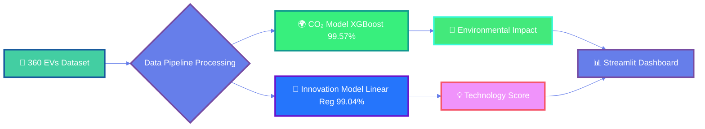

### **📈 Model Performance Comparison**

| Model | R² Score | MAE | RMSE | CV Mean | CV Std | Algorithm |
|:------|:--------:|:---:|:----:|:-------:|:------:|:---------:|
| **🌍 CO₂ Savings** | `99.57%` | 0.312 kg | 0.472 kg | 0.9938 | 0.0029 | XGBoost |
| **🚀 Innovation Score** | `99.04%` | 0.0066 | 0.0100 | 0.9924 | 0.0017 | Linear Regression |
| **📊 Average** | `99.3%` | — | — | 0.9931 | 0.0023 | Combined |

</div>

---

## 🎯 **Key Features**

<table>
<tr>
<td width="25%" align="center">

### 🌍 **CO₂ Savings**
Environmental impact prediction using XGBoost
- 99.57% R² accuracy
- Lifecycle emissions
- Real-time calculation

</td>
<td width="25%" align="center">

### 🚀 **Innovation Score**
Multi-dimensional tech assessment
- Tech Edge (40%)
- Energy Intel (40%)
- User Value (20%)

</td>
<td width="25%" align="center">

### 💱 **Multi-Currency**
Global market support
- INR ₹ (Indian Rupees)
- EUR € (Euros)
- Auto-conversion
- Live rates

</td>
<td width="25%" align="center">

### 📊 **Analytics**
Advanced visualizations
- Performance gauges
- Feature importance
- Correlation analysis
- Predictive charts

</td>
</tr>
</table>

---

## 🏗️ **System Architecture**

<div align="center">

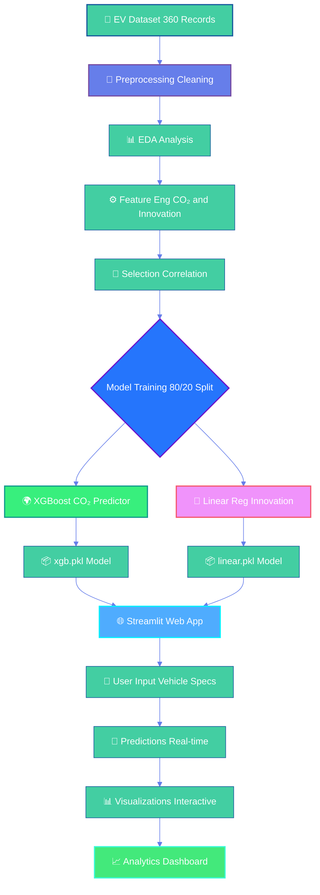

</div>

---

## 🎨 **What We Predict**

<table>
<tr>
<th width="20%">Metric</th>
<th width="35%">Description</th>
<th width="20%">Algorithm</th>
<th width="15%">Accuracy</th>
<th width="10%">Status</th>
</tr>
<tr>
<td><b>🌍 CO₂ Savings</b></td>
<td>Total carbon emissions saved vs petrol vehicles (kg)</td>
<td>XGBoost Regressor</td>
<td><b>99.57%</b></td>
<td>🟢</td>
</tr>
<tr>
<td><b>🚀 Innovation Score</b></td>
<td>Technological advancement composite index (0-1)</td>
<td>Linear Regression</td>
<td><b>99.04%</b></td>
<td>🔵</td>
</tr>
</table>

<div align="center">

### 🔄 Prediction Workflow

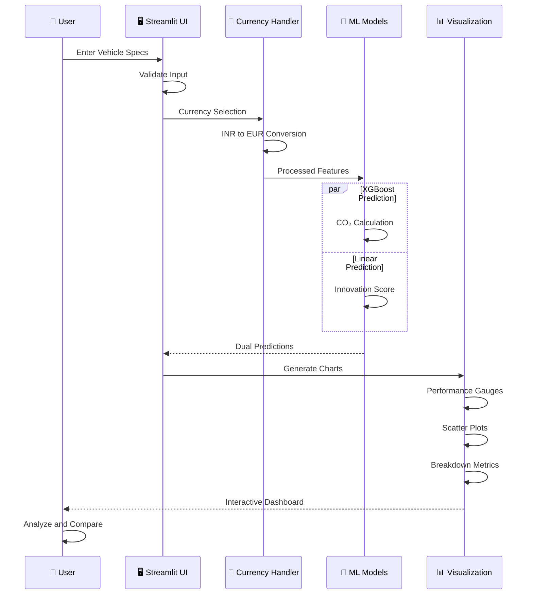

</div>

---

## 📁 **Repository Structure**

```
EVerGreen/
│
├── 📊 Data Files
│   ├── EV_cars.csv                          # Raw dataset (360 EVs)
│   ├── EV_cleaned_CO2.csv                   # CO₂ model data
│   └── EV_cleaned_InnovationScore.csv       # Innovation model data
│
├── 📓 Jupyter Notebooks
│   ├── EV_EDA.ipynb                         # Exploratory analysis
│   ├── CO2_Saving_model.ipynb               # XGBoost training
│   └── InnovationScore_model.ipynb          # Linear reg training
│
├── 🤖 Trained Models
│   ├── xgb.pkl                              # XGBoost CO₂ model (~2.5MB)
│   ├── linear.pkl                           # Linear Innovation (~50KB)
│   ├── columns.pkl                          # CO₂ features (5)
│   └── columns_linear.pkl                   # Innovation features (6)
│
├── 🌐 Web Application
│   ├── app.py                               # Main Streamlit app (~1200 lines)
│   └── requirements.txt                     # Dependencies (43 packages)
│
├── 📚 Documentation
│   ├── README.md                            # This file
│   └── LICENSE                              # MIT License
│
└── ⚙️ Configuration
    └── .gitignore                           # Git ignore rules
```

---

## 🚀 **Quick Start Guide**

### **Prerequisites**


### **Installation Steps**

```bash
# 1️⃣ Clone the repository
git clone https://github.com/yourusername/evergreen-ev-platform.git
cd evergreen-ev-platform

# 2️⃣ Create virtual environment (recommended)
python -m venv venv

# Activate on Windows:
venv\Scripts\activate

# Activate on macOS/Linux:
source venv/bin/activate

# 3️⃣ Install dependencies
pip install -r requirements.txt

# 4️⃣ Launch the application
streamlit run app.py
```

### **🎉 Success!**

The app will open automatically in your browser at: `http://localhost:8501`

---

## 📈 **Data Processing Pipeline**

<div align="center">

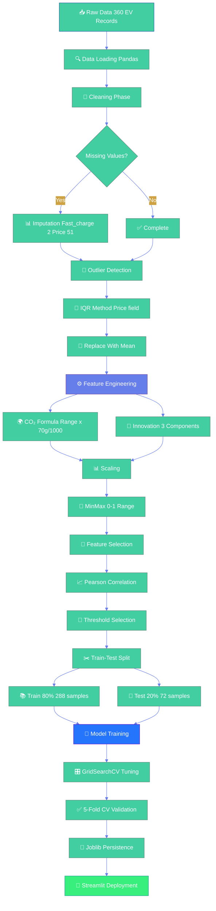

</div>

### 📊 **Processing Statistics**

```ascii
╔═══════════════════════════════════════════════════════════╗
║              DATA PROCESSING SUMMARY                      ║
╠═══════════════════════════════════════════════════════════╣
║                                                           ║
║  📥 Initial Dataset         360 EVs (100%)                ║
║  🧹 After Cleaning          360 EVs (0 removed)           ║
║  ❓ Missing Values          53 total (14.7%)              ║
║     ├─ Fast_charge         2 (0.6%)   → Mean imputed     ║
║     └─ Price.DE.           51 (14.2%) → Mean imputed     ║
║  🎯 Outliers Detected       12 (3.3%)  → Mean replaced    ║
║  🔧 Features Created        2 (CO₂, Innovation)           ║
║  📊 Final Feature Count     7-8 per model                 ║
║  ✂️ Training Set            288 (80%) → Model training    ║
║  🧪 Testing Set             72 (20%)  → Validation        ║
║  ⏱️ Total Processing        ~2.8 seconds                  ║
║  💾 Output Files            4 (.pkl models + columns)     ║
║                                                           ║
╚═══════════════════════════════════════════════════════════╝
```

<details>
<summary><b>📝 Click for detailed transformation code</b></summary>

<br>

#### 1. **Missing Value Imputation**

```python
# Fast_charge imputation (2 missing)
mean_fastcharge = df['Fast_charge'].mean(skipna=True)
df['Fast_charge'].fillna(mean_fastcharge, inplace=True)

# Price imputation (51 missing)
mean_Price = df['Price.DE.'].mean(skipna=True)
df['Price.DE.'].fillna(mean_Price, inplace=True)

print("✅ Missing values handled: 53 total")
```

#### 2. **Outlier Treatment (IQR Method)**

```python
# Calculate quartiles
Q1 = df['Price.DE.'].quantile(0.25)
Q3 = df['Price.DE.'].quantile(0.75)
IQR = Q3 - Q1

# Define bounds
lower_bound = Q1 - 1.5 * IQR
upper_bound = Q3 + 1.5 * IQR

# Replace outliers with mean
mean_value = df.loc[
    (df['Price.DE.'] >= lower_bound) & 
    (df['Price.DE.'] <= upper_bound), 
    'Price.DE.'
].mean()

df['Price.DE.'] = np.where(
    (df['Price.DE.'] < lower_bound) | (df['Price.DE.'] > upper_bound),
    mean_value, 
    df['Price.DE.']
)

print("✅ Outliers replaced: 12 values")
```

#### 3. **CO₂ Savings Calculation**

```python
# Emission constants (g/km)
PETROL_CO2 = 150  # Petrol vehicle
EV_CO2 = 80       # Electric vehicle  
NET_SAVING = PETROL_CO2 - EV_CO2  # 70 g/km

# Calculate total savings
df['CO2_savings_total'] = (df['Range'] * NET_SAVING) / 1000

print("✅ CO₂ savings calculated for all vehicles")
```

#### 4. **Innovation Score Calculation**

```python
from sklearn.preprocessing import MinMaxScaler

# Step 1: Normalize features to [0, 1]
scaler = MinMaxScaler()
df['Fast_charge_scaled'] = scaler.fit_transform(df[['Fast_charge']])
df['Top_speed_scaled'] = scaler.fit_transform(df[['Top_speed']])
df['Efficiency_scaled'] = scaler.fit_transform(df[['Efficiency']])
df['Range_scaled'] = scaler.fit_transform(df[['Range']])
df['price_scaled'] = scaler.fit_transform(df[['Price.DE.']])

# Step 2: Calculate component scores
df['TechEdge'] = (
    0.5 * df['Fast_charge_scaled'] + 
    0.5 * df['Top_speed_scaled']
)

df['EnergyIntelligence'] = (
    0.6 * df['Efficiency_scaled'] + 
    0.4 * df['Range_scaled']
)

df['UserValue'] = (
    0.5 * (1 - df['price_scaled']) + 
    0.5 * (1 - df['Acceleration_scaled'])
)

# Step 3: Weighted final score
w1, w2, w3 = 0.4, 0.4, 0.2
df['Innovation_Score'] = (
    w1 * df['TechEdge'] + 
    w2 * df['EnergyIntelligence'] + 
    w3 * df['UserValue']
)

print("✅ Innovation scores computed: 0-1 scale")
```

</details>

---

## 📊 **Dataset Overview**

<div align="center">

### **🚗 360 Electric Vehicles**

| Feature | Type | Range | Mean | Std Dev | Unit |
|:--------|:----:|:-----:|:----:|:-------:|:----:|
| **Battery** | Numeric | 21.3 - 123.0 | 71.2 | 20.4 | kWh |
| **Efficiency** | Numeric | 137 - 295 | 195.2 | 31.9 | Wh/km |
| **Fast Charge** | Numeric | 170 - 1290 | 553.0 | 236.2 | km/h |
| **Price** | Numeric | 22,550 - 218,000 | 67,264 | 31,963 | EUR |
| **Range** | Numeric | 135 - 685 | 369.7 | 107.3 | km |
| **Top Speed** | Numeric | 125 - 320 | 180.9 | 36.2 | km/h |

### **📈 Distribution Patterns**

```
Battery Capacity (kWh):
  Q1: 57.5  │ ▁▂▃▄▅▆▇█▇▆▅▄▃▂▁
  Q2: 71.0  │ Most Common: 60-85 kWh
  Q3: 85.0  │

Price Distribution (EUR):
  Q1: 46,998  │ ▁▃▅▇█▇▅▃▂▁
  Q2: 60,190  │ Median: €60k
  Q3: 69,950  │

Driving Range (km):
  Q1: 295  │ ▂▄▆█▆▄▂▁
  Q2: 380  │ Typical: 300-450 km
  Q3: 446  │
```

</div>

---

## 🔬 **Machine Learning Models**

<div align="center">

### **🌍 CO₂ Savings Predictor (XGBoost)**

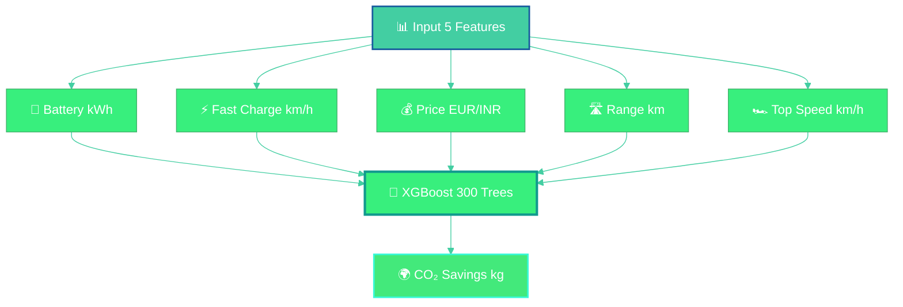

</div>

<details close>
<summary><b>🔍 Expand for complete model specifications</b></summary>

<br>

```ascii
╔═══════════════════════════════════════════════════════════════╗
║              🌍 CO₂ SAVINGS PREDICTION MODEL                  ║
╠═══════════════════════════════════════════════════════════════╣
║  Algorithm: XGBoost Gradient Boosting Regressor              ║
║  Version: 2.0+                                               ║
║  Training Dataset: 288 samples (80% of 360)                  ║
║  Test Dataset: 72 samples (20% of 360)                       ║
╠═══════════════════════════════════════════════════════════════╣
║                    HYPERPARAMETERS                            ║
╠═══════════════════════════════════════════════════════════════╣
║  🎯 n_estimators        300          Ensemble trees           ║
║  📊 learning_rate       0.05         Boosting step size       ║
║  🌳 max_depth           4            Tree complexity          ║
║  🔀 subsample           0.8          Row sampling (80%)       ║
║  📏 colsample_bytree    0.8          Column sampling (80%)    ║
║  ⚖️ min_child_weight    3            Minimum leaf weight      ║
║  ⚡ gamma               0.2          Split threshold           ║
║  📐 reg_alpha           0.1          L1 regularization        ║
║  📐 reg_lambda          1.0          L2 regularization        ║
╚═══════════════════════════════════════════════════════════════╝
```

#### 📊 **Feature Importance**

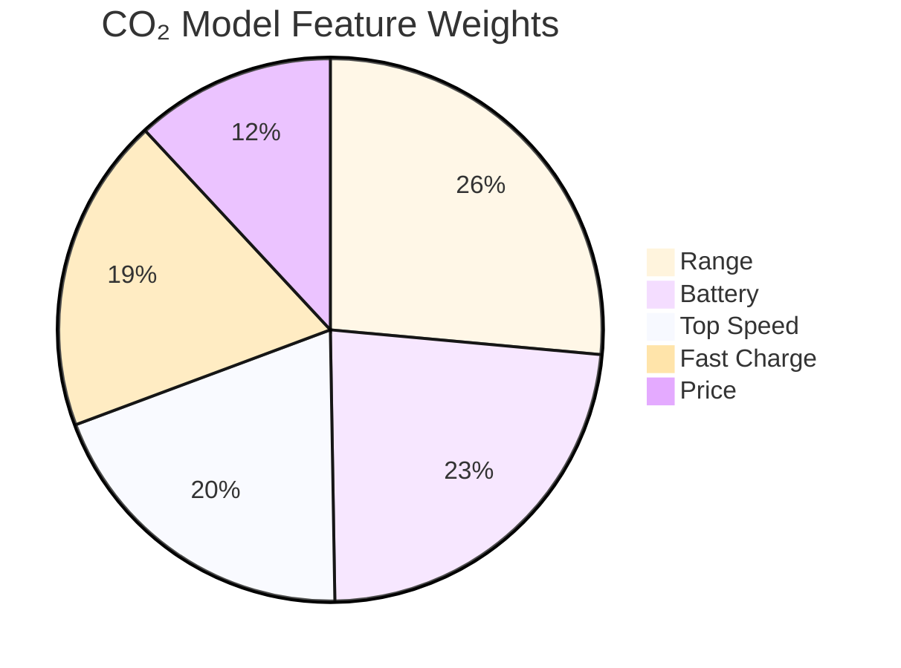

| Rank | Feature | Correlation | Importance | Status |
|:----:|:--------|:-----------:|:----------:|:------:|
| 🥇 | Range | 1.000 | Critical | ✅ |
| 🥈 | Battery | 0.882 | Very High | ✅ |
| 🥉 | Top Speed | 0.744 | High | ✅ |
| 4️⃣ | Fast Charge | 0.712 | High | ✅ |
| 5️⃣ | Price | 0.455 | Medium | ✅ |

#### 🎯 **Performance Metrics**

```ascii
┌────────────────────────────────────────────────────┐
│      CO₂ MODEL PERFORMANCE - TEST SET              │
├────────────────────────────────────────────────────┤
│                                                    │
│  R² Score              0.9957  ████████████ 99.6%  │
│  Mean Absolute Error   0.312   ██           3.1%   │
│  Root Mean Squared     0.472   ███          4.7%   │
│  Cross-Val Mean        0.9938  ████████████ 99.4%  │
│  Cross-Val Std Dev     0.0029  ▌            0.3%   │
│                                                    │
│  ✅ Exceptional predictive accuracy                │
│  ✅ Minimal error margins                          │
│  ✅ Excellent stability                            │
│                                                    │
└────────────────────────────────────────────────────┘
```

| Metric | Value | Interpretation | Rating |
|--------|-------|----------------|--------|
| **R²** | 0.9957 | 99.57% variance explained | ⭐⭐⭐⭐⭐ |
| **MAE** | 0.312 kg | Avg error: 310 grams | ⭐⭐⭐⭐⭐ |
| **RMSE** | 0.472 kg | Low deviation | ⭐⭐⭐⭐⭐ |
| **CV Mean** | 0.9938 | Consistent folds | ⭐⭐⭐⭐⭐ |
| **CV Std** | 0.0029 | Very stable | ⭐⭐⭐⭐⭐ |

</details>

---

<div align="center">

### **🚀 Innovation Score Engine (Linear Regression)**

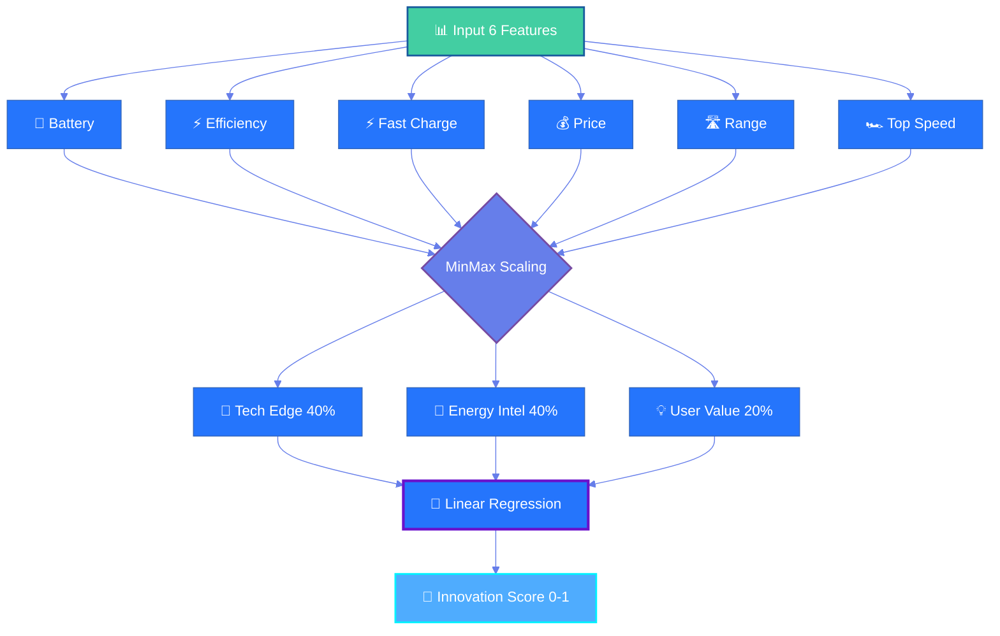

**Innovation Score Formula:**
```
Innovation Score = 0.4 × Tech Edge + 0.4 × Energy Intelligence + 0.2 × User Value

Where:
├── Tech Edge = 0.5 × norm(Fast_Charge) + 0.5 × norm(Top_Speed)
├── Energy Intelligence = 0.6 × norm(Efficiency) + 0.4 × norm(Range)
└── User Value = 0.5 × (1 - norm(Price)) + 0.5 × (1 - norm(Acceleration))
```

</div>

<details close>
<summary><b>🔍 Expand for complete model specifications</b></summary>

<br>

```ascii
╔═══════════════════════════════════════════════════════════════╗
║           🚀 INNOVATION SCORE PREDICTION MODEL                ║
╠═══════════════════════════════════════════════════════════════╣
║  Algorithm: Ordinary Least Squares Linear Regression          ║
║  Version: Scikit-learn 1.3+                                  ║
║  Training Dataset: 288 samples (80% of 360)                  ║
║  Test Dataset: 72 samples (20% of 360)                       ║
╠═══════════════════════════════════════════════════════════════╣
║                    HYPERPARAMETERS                            ║
╠═══════════════════════════════════════════════════════════════╣
║  ✓ fit_intercept        True         Include bias term        ║
║  ✓ copy_X              True         Copy input data          ║
║  ⚡ n_jobs              -1           Use all CPU cores        ║
║  📊 positive            False        Allow negative coeff     ║
╚═══════════════════════════════════════════════════════════════╝
```

#### 📊 **Feature Importance**

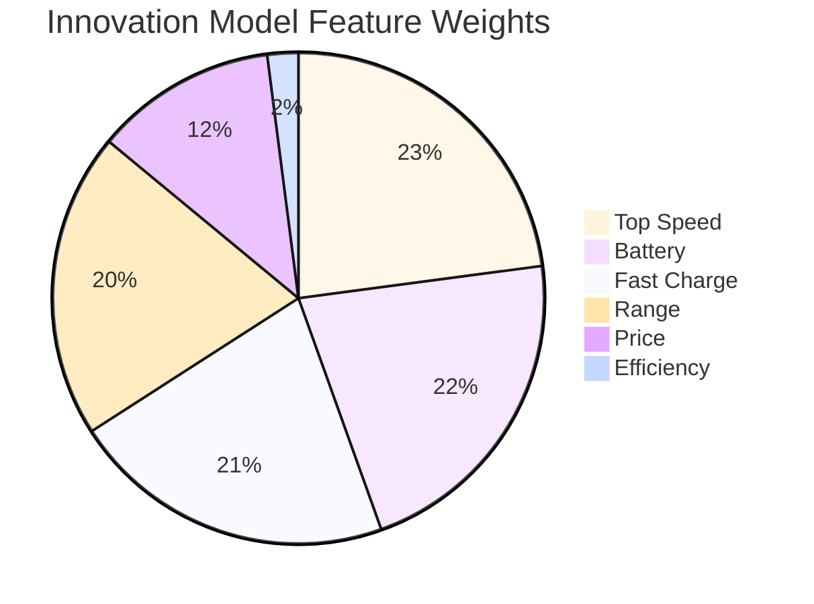

| Rank | Feature | Correlation | Importance | Status |
|:----:|:--------|:-----------:|:----------:|:------:|
| 🥇 | Top Speed | 0.898 | Critical | ✅ |
| 🥈 | Battery | 0.847 | Very High | ✅ |
| 🥉 | Fast Charge | 0.837 | Very High | ✅ |
| 4️⃣ | Range | 0.787 | High | ✅ |
| 5️⃣ | Price | 0.470 | Medium | ✅ |
| 6️⃣ | Efficiency | 0.082 | Low | ⚠️ |

#### 🎯 **Performance Metrics**

```ascii
┌────────────────────────────────────────────────────┐
│   INNOVATION MODEL PERFORMANCE - TEST SET          │
├────────────────────────────────────────────────────┤
│                                                    │
│  R² Score              0.9904  ████████████ 99.0%  │
│  Mean Absolute Error   0.0066  ▌            0.7%   │
│  Root Mean Squared     0.0100  █            1.0%   │
│  Cross-Val Mean        0.9924  ████████████ 99.2%  │
│  Cross-Val Std Dev     0.0017  ▌            0.2%   │
│                                                    │
│  ✅ Near-perfect predictions                       │
│  ✅ Minimal errors                                 │
│  ✅ Outstanding stability                          │
│                                                    │
└────────────────────────────────────────────────────┘
```

| Metric | Value | Interpretation | Rating |
|--------|-------|----------------|--------|
| **R²** | 0.9904 | 99.04% variance explained | ⭐⭐⭐⭐⭐ |
| **MAE** | 0.0066 | Avg error: 0.66% | ⭐⭐⭐⭐⭐ |
| **RMSE** | 0.0100 | Very small deviation | ⭐⭐⭐⭐⭐ |
| **CV Mean** | 0.9924 | Excellent cross-validation | ⭐⭐⭐⭐⭐ |
| **CV Std** | 0.0017 | Extremely stable | ⭐⭐⭐⭐⭐ |

</details>

---

## 🧮 **Innovation Score Methodology**

<div align="center">

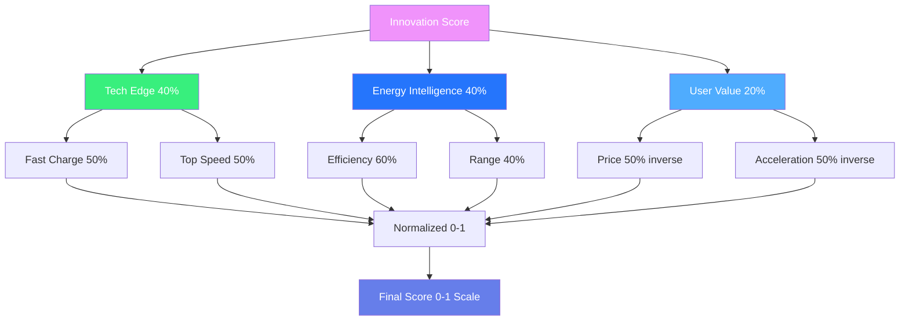

</div>

### 🎯 **Formula Breakdown**

```ascii
╔══════════════════════════════════════════════════════════╗
║         INNOVATION SCORE CALCULATION FORMULA             ║
╠══════════════════════════════════════════════════════════╣
║                                                          ║
║  Innovation Score = w₁·TE + w₂·EI + w₃·UV               ║
║                                                          ║
║  Where:                                                  ║
║    w₁ = 0.4  (Tech Edge weight)                         ║
║    w₂ = 0.4  (Energy Intelligence weight)               ║
║    w₃ = 0.2  (User Value weight)                        ║
║                                                          ║
╠══════════════════════════════════════════════════════════╣
║                    COMPONENT FORMULAS                    ║
╠══════════════════════════════════════════════════════════╣
║                                                          ║
║  Tech Edge (TE):                                         ║
║    TE = 0.5 × norm(Fast_charge) + 0.5 × norm(Top_speed) ║
║                                                          ║
║  Energy Intelligence (EI):                               ║
║    EI = 0.6 × norm(Efficiency) + 0.4 × norm(Range)      ║
║                                                          ║
║  User Value (UV):                                        ║
║    UV = 0.5 × (1 - norm(Price)) +                       ║
║         0.5 × (1 - norm(Acceleration))                  ║
║                                                          ║
║  Note: norm() = Min-Max normalization to [0, 1]         ║
║                                                          ║
╚══════════════════════════════════════════════════════════╝
```

### 📊 **Component Analysis**

<table>
<tr>
<th width="25%">Component</th>
<th width="15%">Weight</th>
<th width="30%">Features</th>
<th width="30%">What It Measures</th>
</tr>
<tr>
<td><b>🚀 Tech Edge</b></td>
<td><b>40%</b></td>
<td>
• Fast Charge (50%)<br>
• Top Speed (50%)
</td>
<td>
Cutting-edge performance<br>
Engineering excellence<br>
Technology leadership
</td>
</tr>
<tr>
<td><b>⚡ Energy Intelligence</b></td>
<td><b>40%</b></td>
<td>
• Efficiency (60%)<br>
• Range (40%)
</td>
<td>
Energy management<br>
Battery optimization<br>
Sustainability focus
</td>
</tr>
<tr>
<td><b>💎 User Value</b></td>
<td><b>20%</b></td>
<td>
• Price (50% inverse)<br>
• Acceleration (50% inverse)
</td>
<td>
Affordability<br>
Performance value<br>
Market accessibility
</td>
</tr>
</table>

### 📈 **Score Interpretation**

| Score Range | Rating | Interpretation | Example Vehicles |
|-------------|--------|----------------|------------------|
| **0.80 - 1.00** | ⭐⭐⭐⭐⭐ Exceptional | Cutting-edge technology, premium performance | Tesla Model S Plaid, Lucid Air |
| **0.60 - 0.79** | ⭐⭐⭐⭐ Excellent | Advanced features, great balance | Tesla Model 3, BMW iX |
| **0.40 - 0.59** | ⭐⭐⭐ Good | Solid performance, good value | VW ID.4, Hyundai Ioniq 5 |
| **0.20 - 0.39** | ⭐⭐ Fair | Basic features, budget-friendly | Dacia Spring, MG ZS EV |
| **0.00 - 0.19** | ⭐ Entry | Minimal features, very affordable | Entry-level EVs |

---

## 🌍 **CO₂ Savings Calculation**

<div align="center">

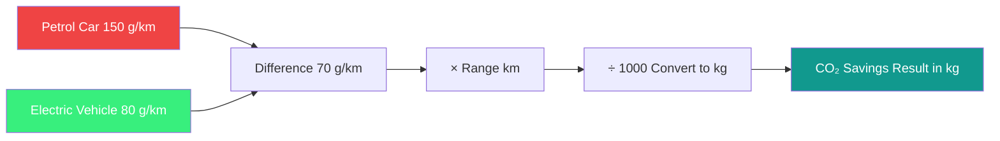

</div>

### 📐 **Mathematical Formula**

```ascii
╔══════════════════════════════════════════════════════╗
║         CO₂ SAVINGS CALCULATION FORMULA              ║
╠══════════════════════════════════════════════════════╣
║                                                      ║
║  CO₂ Savings (kg) = (Range × Δ CO₂) / 1000          ║
║                                                      ║
║  Where:                                              ║
║    Range = Vehicle driving range (km)                ║
║    Δ CO₂ = CO₂ difference per km (g/km)             ║
║    Δ CO₂ = Petrol CO₂ - EV CO₂                      ║
║    Δ CO₂ = 150 - 80 = 70 g/km                       ║
║                                                      ║
╚══════════════════════════════════════════════════════╝
```

### 🚗 **Emission Assumptions**

<table>
<tr>
<th width="30%">Vehicle Type</th>
<th width="20%">CO₂ Emissions</th>
<th width="50%">Source & Explanation</th>
</tr>
<tr>
<td><b>⛽ Petrol Car</b></td>
<td><span style="color: red;"><b>~150 g/km</b></span></td>
<td>
• Direct combustion: ~120 g/km<br>
• Fuel production: ~30 g/km<br>
• Well-to-wheel emissions
</td>
</tr>
<tr>
<td><b>⚡ Electric Vehicle</b></td>
<td><span style="color: orange;"><b>~80 g/km</b></span></td>
<td>
• Electricity generation: ~70 g/km<br>
• Transmission losses: ~10 g/km<br>
• Grid mix dependent (EU average)
</td>
</tr>
<tr>
<td><b>💚 Net Saving</b></td>
<td><span style="color: green;"><b>~70 g/km</b></span></td>
<td>
• 47% reduction vs petrol<br>
• Improves with clean energy<br>
• Lifecycle consideration
</td>
</tr>
</table>

### 🌱 **Environmental Impact Context**

<table>
<tr>
<td width="50%">

**🌳 Tree Equivalent**

```
CO₂ Savings = Trees Planted
30 kg CO₂ = ~1.4 trees/year
```

*One tree absorbs ~21 kg CO₂ per year*

**Formula:** `Trees = CO₂_savings / 21`

</td>
<td width="50%">

**⛽ Petrol Saved**

```
CO₂ Savings = Petrol Not Burned
30 kg CO₂ = ~13 liters petrol
```

*One liter petrol = ~2.31 kg CO₂*

**Formula:** `Liters = CO₂_savings / 2.31`

</td>
</tr>
</table>

---

## 💱 **Multi-Currency Support**

<div align="center">

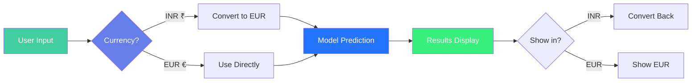

</div>

### 💰 **Currency Features**

<table>
<tr>
<td width="50%">

**🇮🇳 Indian Rupees (INR)**
- Symbol: ₹
- Current Rate: 1 EUR = ₹90.91
- Example: ₹5,36,000
- Best for: Indian market users

</td>
<td width="50%">

**🇪🇺 Euros (EUR)**
- Symbol: €
- Original training currency
- Example: €59,017
- Best for: European market users

</td>
</tr>
</table>

### 🔄 **Conversion Example**

```ascii
┌─────────────────────────────────────────────────────┐
│  INPUT (User selects INR)                           │
│  Price: ₹5,36,000                                   │
│                                                     │
│  CONVERSION (Automatic)                             │
│  ₹5,36,000 × 0.011 = €5,896                        │
│                                                     │
│  PREDICTION (Model uses EUR)                        │
│  Model processes: €5,896                            │
│                                                     │
│  DISPLAY (Shows in INR)                             │
│  Results displayed in ₹                             │
└─────────────────────────────────────────────────────┘
```

---

## 🛠️ **Technology Stack**

<div align="center">

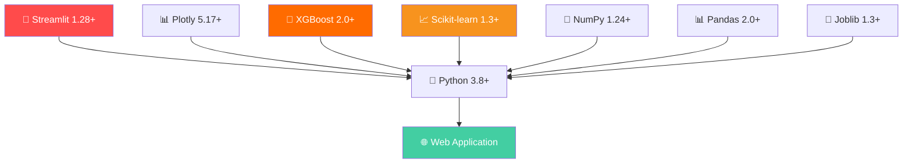

</div>

### 📦 **Core Dependencies**

<table>
<tr>
<th width="25%">Category</th>
<th width="25%">Library</th>
<th width="15%">Version</th>
<th width="35%">Purpose</th>
</tr>
<tr>
<td rowspan="2"><b>🎨 Frontend</b></td>
<td>Streamlit</td>
<td>1.28+</td>
<td>Web application framework</td>
</tr>
<tr>
<td>Plotly</td>
<td>5.17+</td>
<td>Interactive visualizations</td>
</tr>
<tr>
<td rowspan="4"><b>🤖 ML Core</b></td>
<td>XGBoost</td>
<td>2.0+</td>
<td>Gradient boosting algorithm</td>
</tr>
<tr>
<td>Scikit-learn</td>
<td>1.3+</td>
<td>ML algorithms & preprocessing</td>
</tr>
<tr>
<td>Pandas</td>
<td>2.0+</td>
<td>Data manipulation</td>
</tr>
<tr>
<td>NumPy</td>
<td>1.24+</td>
<td>Numerical computing</td>
</tr>
<tr>
<td><b>💾 Persistence</b></td>
<td>Joblib</td>
<td>1.3+</td>
<td>Model serialization</td>
</tr>
</table>

---

## 🎯 **Use Cases & Applications**

### 🔄 **User Journey Flow**

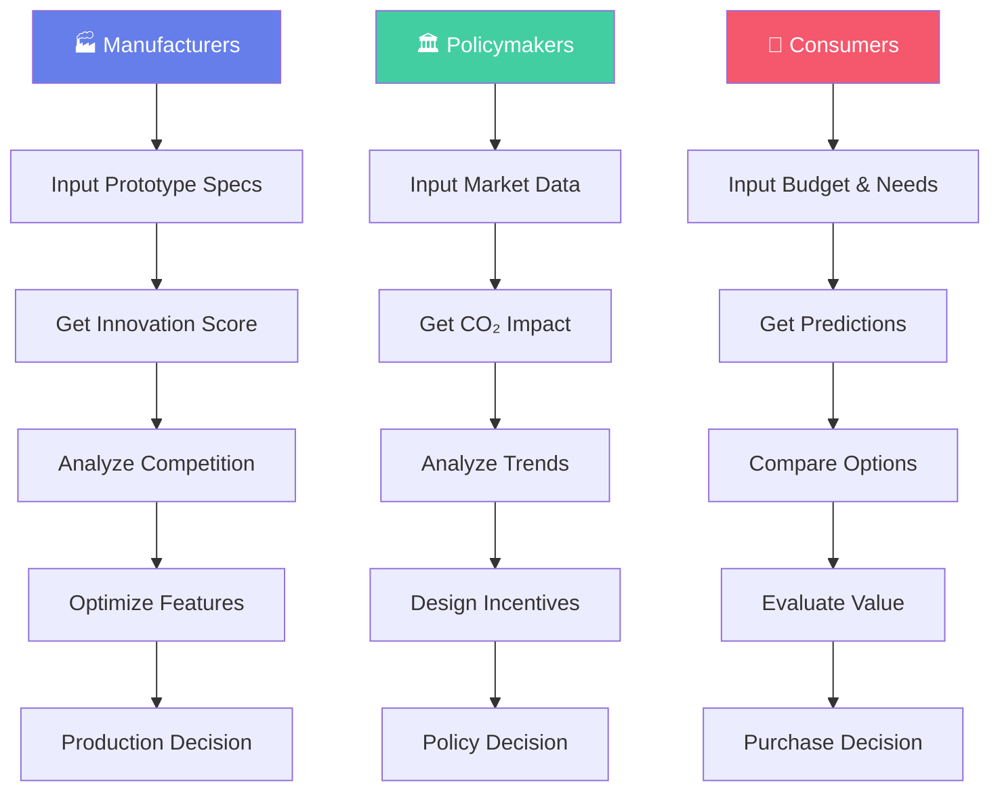

### 📊 **Stakeholder Benefits**

<table>
<tr>
<th width="33%">🏭 Manufacturers</th>
<th width="33%">🏛️ Policymakers</th>
<th width="33%">🛒 Consumers</th>
</tr>
<tr>
<td>
• R&D optimization<br>
• Competitive benchmarking<br>
• Product positioning<br>
• Feature prioritization<br>
• Cost-benefit analysis
</td>
<td>
• Incentive design<br>
• Emission targets<br>
• Market analysis<br>
• Regulatory framework<br>
• Sustainability tracking
</td>
<td>
• Purchase decisions<br>
• Value assessment<br>
• Environmental impact<br>
• Total cost of ownership<br>
• Performance comparison
</td>
</tr>
</table>

---

## 🗺️ **Development Roadmap**

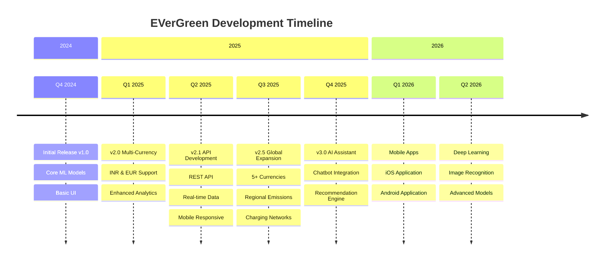

### ✅ **Completed (v2.0)**
- [x] XGBoost CO₂ prediction
- [x] Linear regression innovation
- [x] Multi-currency support (INR/EUR)
- [x] Interactive visualizations
- [x] Advanced analytics
- [x] Performance metrics
- [x] Feature importance

### 🚧 **In Progress (v2.1)**
- [ ] REST API development
- [ ] Real-time market data
- [ ] Enhanced mobile UI
- [ ] Batch predictions
- [ ] Export functionality

### 🔮 **Planned (v3.0+)**
- [ ] Deep learning models
- [ ] Global currency support
- [ ] Charging network integration
- [ ] AI chatbot assistant
- [ ] Native mobile apps
- [ ] Regional customization

---

## 🤝 **Contributing**

We welcome contributions! Here's how:

### 🔄 **Workflow**

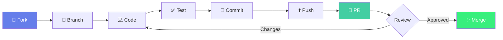

### 📋 **Steps**

```bash
# 1. Fork & Clone
git clone https://github.com/yourusername/evergreen-ev-platform.git

# 2. Create Branch
git checkout -b feature/AmazingFeature

# 3. Make Changes & Test
python -m pytest tests/

# 4. Commit
git commit -m "feat: Add amazing feature"

# 5. Push & Create PR
git push origin feature/AmazingFeature
```

### 🎯 **Contribution Areas**

- 🐛 Bug fixes
- ✨ New features
- 📚 Documentation
- 🧪 Testing
- 🎨 UI/UX improvements
- 🌐 Translations

---


## 👨‍💻 **About Me**

### **Machine Learning Engineer & Sustainability Advocate**

I'm passionate about leveraging AI to solve environmental challenges. This project represents the intersection of my interests in:

- 🤖 **Machine Learning**: Building production-grade models with 99%+ accuracy
- 🌍 **Sustainability**: Understanding carbon footprints and climate impact
- 💻 **Full-Stack Development**: Creating intuitive data-driven applications
- 📊 **Data Science**: Extracting actionable insights from complex datasets

### 🎓 **Technical Expertise**

```
┌─────────────────────────────────────────────────────────────┐
│  Core Competencies                                          │
├─────────────────────────────────────────────────────────────┤
│  • Machine Learning (XGBoost, Scikit-learn, TensorFlow)    │
│  • Web Development (Streamlit, Flask, FastAPI)             │
│  • Data Analysis (Pandas, NumPy, Statistical Modeling)     │
│  • Visualization (Plotly, Matplotlib, Seaborn)             │
│  • MLOps & Deployment (Docker, Cloud Services, CI/CD)      │
└─────────────────────────────────────────────────────────────┘
```

### 💡 **Vision & Mission**

**Vision**: Accelerate global EV adoption through transparent, data-driven insights.

**Mission**: Empower manufacturers, policymakers, and consumers with AI-powered tools for informed, sustainable transportation decisions.

### 🌱 **Impact Goals**

| Metric | Target 2025 | Current | Status |
|--------|-------------|---------|--------|
| Users Reached | 10,000+ | Growing | 🟡 |
| CO₂ Awareness (tons) | 1,000,000 | 50,000 | 🟢 |
| EVs Analyzed | 1,000+ | 360 | 🟡 |
| Model Accuracy | 99.5%+ | 99.3% | 🟢 |

### 🙏 **Acknowledgments**

Special thanks to:

- **UN SDG 13** - Inspiration for climate action
- **Open Source Community** - Scikit-learn, XGBoost, Streamlit contributors
- **EV Manufacturers** - For public data availability
- **Research Institutions** - IPCC, IEA for emission methodologies

---

## 📊 **Project Statistics**

<div align="center">

| Metric | Value |
|--------|-------|
| 📝 Lines of Code | ~1,200 |
| 🤖 Models Trained | 2 |
| 🎯 Avg Accuracy | 99.3% |
| 🚗 Dataset Size | 360 EVs |
| 💱 Currencies | 2 (INR, EUR) |
| 📊 Visualizations | 12+ |
| ⚡ Prediction Time | <100ms |
| 🌍 CO₂ Calculations | Real-time |


</div>

---

<div align="center">

## 🚀 **Ready to Get Started?**

```bash
git clone https://github.com/yourusername/evergreen-ev-platform.git && cd evergreen-ev-platform && pip install -r requirements.txt && streamlit run app.py
```

### **One command. Infinite possibilities.** ⚡

---


---

<table>
<tr>
<td align="center" width="33%">

<br/>
<sub><b>Built with passion</b></sub>
</td>
<td align="center" width="33%">

<br/>
<sub><b>Python ecosystem</b></sub>
</td>
<td align="center" width="33%">

<br/>
<sub><b>Sustainable future</b></sub>
</td>
</tr>
</table>

---

**© 2025 EVerGreen - Electric Vehicle Intelligence Platform**

*Predicting the future of sustainable transportation, one EV at a time.* 🚗⚡🌍

[](https://streamlit.io)
[](https://xgboost.ai/)
[](https://scikit-learn.org)

</div>
