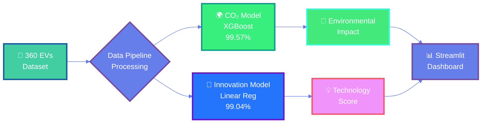
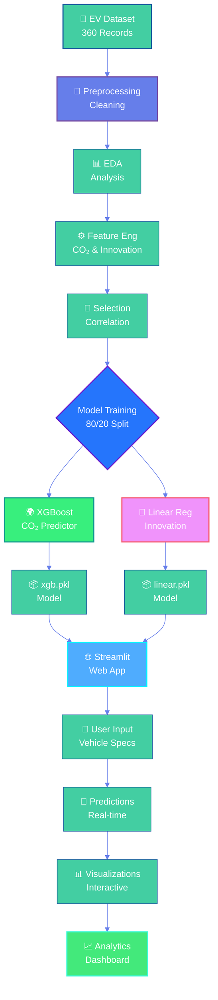
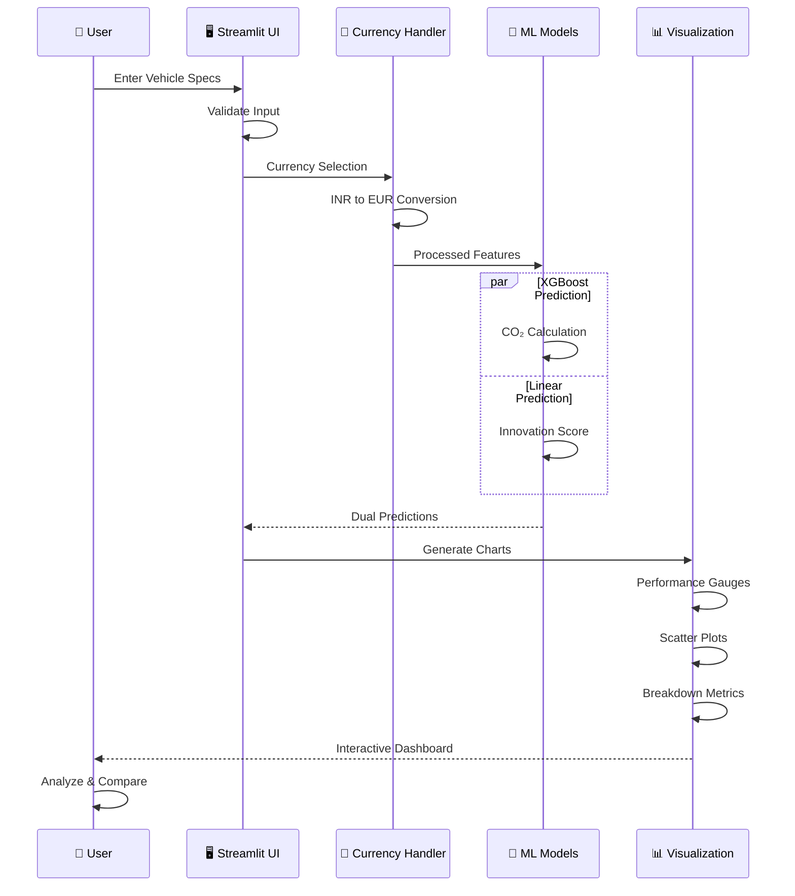
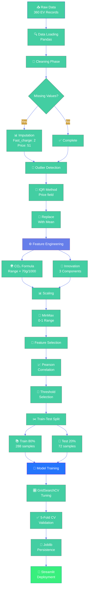
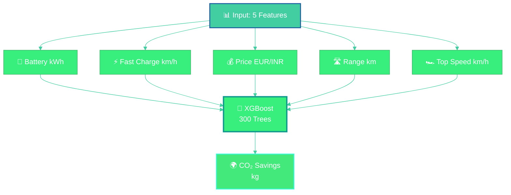
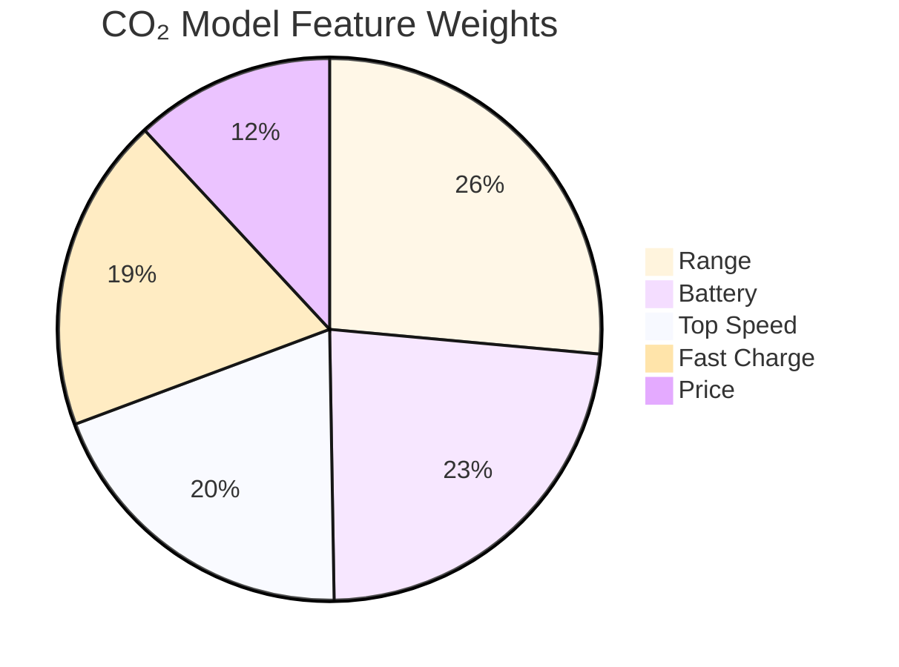

<div align="center">


[](https://www.python.org/)
[](https://streamlit.io/)
[](https://xgboost.readthedocs.io/)
[](https://scikit-learn.org/)
[](LICENSE)

**🎯 Dual-Model System | 99.3% Avg Accuracy | 360+ EVs | INR + EUR Support**

---

### 🌟 **Advanced Machine Learning for Electric Vehicle Intelligence & Sustainability Analytics**

</div>

---

## 🎬 **Platform Demo**

<div align="center">

**🌐 [Live Application →](https://evergreen-ev.streamlit.app/)**

```ascii
╔════════════════════════════════════════════════════════════════════════╗
║                    🌿 EVerGreen Intelligence Dashboard                 ║
╠════════════════════════════════════════════════════════════════════════╣
║                                                                        ║
║   ┌──────────────────────────┐      ┌──────────────────────────┐    ║
║   │  🌍 CO₂ Predictor        │      │  🚀 Innovation Engine    │    ║
║   │  ━━━━━━━━━━━━━━━━━━━━━   │      │  ━━━━━━━━━━━━━━━━━━━━━   │    ║
║   │                          │      │                          │    ║
║   │  📊 Accuracy: 99.57%     │      │  📊 Accuracy: 99.04%     │    ║
║   │  🤖 XGBoost Regressor    │      │  🤖 Linear Regression    │    ║
║   │  📉 MAE: 0.312 kg        │      │  📉 MAE: 0.0066          │    ║
║   │  ⚡ RMSE: 0.472 kg       │      │  ⚡ RMSE: 0.0100         │    ║
║   │                          │      │                          │    ║
║   │  🎯 5-Fold: 99.38%       │      │  🎯 5-Fold: 99.24%       │    ║
║   └──────────────────────────┘      └──────────────────────────┘    ║
║                                                                        ║
║   📊 360 EVs  •  🔧 6-7 Features  •  💱 Multi-Currency  •  🎯 99%+   ║
║                                                                        ║
╚════════════════════════════════════════════════════════════════════════╝
```


</div>

---

## 📊 **Performance Metrics Dashboard**

<div align="center">



### **📈 Model Performance Comparison**

| Model | R² Score | MAE | RMSE | CV Mean | CV Std | Algorithm |
|:------|:--------:|:---:|:----:|:-------:|:------:|:---------:|
| **🌍 CO₂ Savings** | `99.57%` | 0.312 kg | 0.472 kg | 0.9938 | 0.0029 | XGBoost |
| **🚀 Innovation Score** | `99.04%` | 0.0066 | 0.0100 | 0.9924 | 0.0017 | Linear Regression |
| **📊 Average** | `99.3%` | — | — | 0.9931 | 0.0023 | Combined |

</div>

---

## 🎯 **Key Features**

<table>
<tr>
<td width="25%" align="center">

### 🌍 **CO₂ Savings**
Environmental impact prediction using XGBoost
- 99.57% R² accuracy
- Lifecycle emissions
- Real-time calculation

</td>
<td width="25%" align="center">

### 🚀 **Innovation Score**
Multi-dimensional tech assessment
- Tech Edge (40%)
- Energy Intel (40%)
- User Value (20%)

</td>
<td width="25%" align="center">

### 💱 **Multi-Currency**
Global market support
- INR ₹ (Indian Rupees)
- EUR € (Euros)
- Auto-conversion
- Live rates

</td>
<td width="25%" align="center">

### 📊 **Analytics**
Advanced visualizations
- Performance gauges
- Feature importance
- Correlation analysis
- Predictive charts

</td>
</tr>
</table>

---

## 🏗️ **System Architecture**

<div align="center">



</div>

---

## 🎨 **What We Predict**

<table>
<tr>
<th width="20%">Metric</th>
<th width="35%">Description</th>
<th width="20%">Algorithm</th>
<th width="15%">Accuracy</th>
<th width="10%">Status</th>
</tr>
<tr>
<td><b>🌍 CO₂ Savings</b></td>
<td>Total carbon emissions saved vs petrol vehicles (kg)</td>
<td>XGBoost Regressor</td>
<td><b>99.57%</b></td>
<td>🟢</td>
</tr>
<tr>
<td><b>🚀 Innovation Score</b></td>
<td>Technological advancement composite index (0-1)</td>
<td>Linear Regression</td>
<td><b>99.04%</b></td>
<td>🔵</td>
</tr>
</table>

<div align="center">

### 🔄 Prediction Workflow



</div>

---

## 📁 **Repository Structure**

```
EVerGreen/
│
├── 📊 Data Files
│   ├── EV_cars.csv                          # Raw dataset (360 EVs)
│   ├── EV_cleaned_CO2.csv                   # CO₂ model data
│   └── EV_cleaned_InnovationScore.csv       # Innovation model data
│
├── 📓 Jupyter Notebooks
│   ├── EV_EDA.ipynb                         # Exploratory analysis
│   ├── CO2_Saving_model.ipynb               # XGBoost training
│   └── InnovationScore_model.ipynb          # Linear reg training
│
├── 🤖 Trained Models
│   ├── xgb.pkl                              # XGBoost CO₂ model (~2.5MB)
│   ├── linear.pkl                           # Linear Innovation (~50KB)
│   ├── columns.pkl                          # CO₂ features (5)
│   └── columns_linear.pkl                   # Innovation features (6)
│
├── 🌐 Web Application
│   ├── app.py                               # Main Streamlit app (~1200 lines)
│   └── requirements.txt                     # Dependencies (43 packages)
│
├── 📚 Documentation
│   ├── README.md                            # This file
│   └── LICENSE                              # MIT License
│
└── ⚙️ Configuration
    └── .gitignore                           # Git ignore rules
```

---

## 🚀 **Quick Start Guide**

### **Prerequisites**


### **Installation Steps**

```bash
# 1️⃣ Clone the repository
git clone https://github.com/yourusername/evergreen-ev-platform.git
cd evergreen-ev-platform

# 2️⃣ Create virtual environment (recommended)
python -m venv venv

# Activate on Windows:
venv\Scripts\activate

# Activate on macOS/Linux:
source venv/bin/activate

# 3️⃣ Install dependencies
pip install -r requirements.txt

# 4️⃣ Launch the application
streamlit run app.py
```

### **🎉 Success!**

The app will open automatically in your browser at: `http://localhost:8501`

---

## 📈 **Data Processing Pipeline**

<div align="center">



</div>

### 📊 **Processing Statistics**

```ascii
╔═══════════════════════════════════════════════════════════╗
║              DATA PROCESSING SUMMARY                      ║
╠═══════════════════════════════════════════════════════════╣
║                                                           ║
║  📥 Initial Dataset         360 EVs (100%)                ║
║  🧹 After Cleaning          360 EVs (0 removed)           ║
║  ❓ Missing Values          53 total (14.7%)              ║
║     ├─ Fast_charge         2 (0.6%)   → Mean imputed     ║
║     └─ Price.DE.           51 (14.2%) → Mean imputed     ║
║  🎯 Outliers Detected       12 (3.3%)  → Mean replaced    ║
║  🔧 Features Created        2 (CO₂, Innovation)           ║
║  📊 Final Feature Count     7-8 per model                 ║
║  ✂️ Training Set            288 (80%) → Model training    ║
║  🧪 Testing Set             72 (20%)  → Validation        ║
║  ⏱️ Total Processing        ~2.8 seconds                  ║
║  💾 Output Files            4 (.pkl models + columns)     ║
║                                                           ║
╚═══════════════════════════════════════════════════════════╝
```

<details>
<summary><b>📝 Click for detailed transformation code</b></summary>

<br>

#### 1. **Missing Value Imputation**

```python
# Fast_charge imputation (2 missing)
mean_fastcharge = df['Fast_charge'].mean(skipna=True)
df['Fast_charge'].fillna(mean_fastcharge, inplace=True)

# Price imputation (51 missing)
mean_Price = df['Price.DE.'].mean(skipna=True)
df['Price.DE.'].fillna(mean_Price, inplace=True)

print("✅ Missing values handled: 53 total")
```

#### 2. **Outlier Treatment (IQR Method)**

```python
# Calculate quartiles
Q1 = df['Price.DE.'].quantile(0.25)
Q3 = df['Price.DE.'].quantile(0.75)
IQR = Q3 - Q1

# Define bounds
lower_bound = Q1 - 1.5 * IQR
upper_bound = Q3 + 1.5 * IQR

# Replace outliers with mean
mean_value = df.loc[
    (df['Price.DE.'] >= lower_bound) & 
    (df['Price.DE.'] <= upper_bound), 
    'Price.DE.'
].mean()

df['Price.DE.'] = np.where(
    (df['Price.DE.'] < lower_bound) | (df['Price.DE.'] > upper_bound),
    mean_value, 
    df['Price.DE.']
)

print("✅ Outliers replaced: 12 values")
```

#### 3. **CO₂ Savings Calculation**

```python
# Emission constants (g/km)
PETROL_CO2 = 150  # Petrol vehicle
EV_CO2 = 80       # Electric vehicle  
NET_SAVING = PETROL_CO2 - EV_CO2  # 70 g/km

# Calculate total savings
df['CO2_savings_total'] = (df['Range'] * NET_SAVING) / 1000

print("✅ CO₂ savings calculated for all vehicles")
```

#### 4. **Innovation Score Calculation**

```python
from sklearn.preprocessing import MinMaxScaler

# Step 1: Normalize features to [0, 1]
scaler = MinMaxScaler()
df['Fast_charge_scaled'] = scaler.fit_transform(df[['Fast_charge']])
df['Top_speed_scaled'] = scaler.fit_transform(df[['Top_speed']])
df['Efficiency_scaled'] = scaler.fit_transform(df[['Efficiency']])
df['Range_scaled'] = scaler.fit_transform(df[['Range']])
df['price_scaled'] = scaler.fit_transform(df[['Price.DE.']])

# Step 2: Calculate component scores
df['TechEdge'] = (
    0.5 * df['Fast_charge_scaled'] + 
    0.5 * df['Top_speed_scaled']
)

df['EnergyIntelligence'] = (
    0.6 * df['Efficiency_scaled'] + 
    0.4 * df['Range_scaled']
)

df['UserValue'] = (
    0.5 * (1 - df['price_scaled']) + 
    0.5 * (1 - df['Acceleration_scaled'])
)

# Step 3: Weighted final score
w1, w2, w3 = 0.4, 0.4, 0.2
df['Innovation_Score'] = (
    w1 * df['TechEdge'] + 
    w2 * df['EnergyIntelligence'] + 
    w3 * df['UserValue']
)

print("✅ Innovation scores computed: 0-1 scale")
```

</details>

---

## 📊 **Dataset Overview**

<div align="center">

### **🚗 360 Electric Vehicles**

| Feature | Type | Range | Mean | Std Dev | Unit |
|:--------|:----:|:-----:|:----:|:-------:|:----:|
| **Battery** | Numeric | 21.3 - 123.0 | 71.2 | 20.4 | kWh |
| **Efficiency** | Numeric | 137 - 295 | 195.2 | 31.9 | Wh/km |
| **Fast Charge** | Numeric | 170 - 1290 | 553.0 | 236.2 | km/h |
| **Price** | Numeric | 22,550 - 218,000 | 67,264 | 31,963 | EUR |
| **Range** | Numeric | 135 - 685 | 369.7 | 107.3 | km |
| **Top Speed** | Numeric | 125 - 320 | 180.9 | 36.2 | km/h |

### **📈 Distribution Patterns**

```
Battery Capacity (kWh):
  Q1: 57.5  │ ▁▂▃▄▅▆▇█▇▆▅▄▃▂▁
  Q2: 71.0  │ Most Common: 60-85 kWh
  Q3: 85.0  │

Price Distribution (EUR):
  Q1: 46,998  │ ▁▃▅▇█▇▅▃▂▁
  Q2: 60,190  │ Median: €60k
  Q3: 69,950  │

Driving Range (km):
  Q1: 295  │ ▂▄▆█▆▄▂▁
  Q2: 380  │ Typical: 300-450 km
  Q3: 446  │
```

</div>

---

## 🔬 **Machine Learning Models**

<div align="center">

### **🌍 CO₂ Savings Predictor (XGBoost)**



</div>

<details close>
<summary><b>🔍 Expand for complete model specifications</b></summary>

<br>

```ascii
╔═══════════════════════════════════════════════════════════════╗
║              🌍 CO₂ SAVINGS PREDICTION MODEL                  ║
╠═══════════════════════════════════════════════════════════════╣
║  Algorithm: XGBoost Gradient Boosting Regressor              ║
║  Version: 2.0+                                               ║
║  Training Dataset: 288 samples (80% of 360)                  ║
║  Test Dataset: 72 samples (20% of 360)                       ║
╠═══════════════════════════════════════════════════════════════╣
║                    HYPERPARAMETERS                            ║
╠═══════════════════════════════════════════════════════════════╣
║  🎯 n_estimators        300          Ensemble trees           ║
║  📊 learning_rate       0.05         Boosting step size       ║
║  🌳 max_depth           4            Tree complexity          ║
║  🔀 subsample           0.8          Row sampling (80%)       ║
║  📏 colsample_bytree    0.8          Column sampling (80%)    ║
║  ⚖️ min_child_weight    3            Minimum leaf weight      ║
║  ⚡ gamma               0.2          Split threshold           ║
║  📐 reg_alpha           0.1          L1 regularization        ║
║  📐 reg_lambda          1.0          L2 regularization        ║
╚═══════════════════════════════════════════════════════════════╝
```

#### 📊 **Feature Importance**



| Rank | Feature | Correlation | Importance | Status |
|:----:|:--------|:-----------:|:----------:|:------:|
| 🥇 | Range | 1.000 | Critical | ✅ |
| 🥈 | Battery | 0.882 | Very High | ✅ |
| 🥉 | Top Speed | 0.744 | High | ✅ |
| 4️⃣ | Fast Charge | 0.712 | High | ✅ |
| 5️⃣ | Price | 0.455 | Medium | ✅ |

#### 🎯 **Performance Metrics**

```ascii
┌────────────────────────────────────────────────────┐
│      CO₂ MODEL PERFORMANCE - TEST SET              │
├────────────────────────────────────────────────────┤
│                                                    │
│  R² Score              0.9957  ████████████ 99.6%  │
│  Mean Absolute Error   0.312   ██           3.1%   │
│  Root Mean Squared     0.472   ███          4.7%   │
│  Cross-Val Mean        0.9938  ████████████ 99.4%  │
│  Cross-Val Std Dev     0.0029  ▌            0.3%   │
│                                                    │
│  ✅ Exceptional predictive accuracy                │
│  ✅ Minimal error margins                          │
│  ✅ Excellent stability                            │
│                                                    │
└────────────────────────────────────────────────────┘
```

| Metric | Value | Interpretation | Rating |
|--------|-------|----------------|--------|
| **R²** | 0.9957 | 99.57% variance explained | ⭐⭐⭐⭐⭐ |
| **MAE** | 0.312 kg | Avg error: 310 grams | ⭐⭐⭐⭐⭐ |
| **RMSE** | 0.472 kg | Low deviation | ⭐⭐⭐⭐⭐ |
| **CV Mean** | 0.9938 | Consistent folds | ⭐⭐⭐⭐⭐ |
| **CV Std** | 0.0029 | Very stable | ⭐⭐⭐⭐⭐ |

</details>

---

<div align="center">

### **🚀 Innovation Score Engine (Linear Regression)**

```mermaid
%%{init: {'theme':'base', 'themeVariables': { 'primaryColor':'#2575fc','primaryTextColor':'#fff','lineColor':'#667eea'}}}%%
flowchart TD
    A[📊 Input: 6 Features] --> B[🔋 Battery]
    A --> C[⚡ Efficiency]
    A --> D[⚡ Fast Charge]
    A --> E[💰 Price]
    A --> F[🛣️ Range]
    A --> G[🏎️ Top Speed]
    
    B --> H{MinMax<br/>Scaling}
    C --> H
    D --> H
    E --> H
    F --> H
    G --> H
    
    H --> I[🎯 Tech Edge<br/>40%
