# 🌿 EVerGreen - AI-Powered EV Intelligence Platform

[](https://www.python.org/)
[](https://streamlit.io/)
[](https://xgboost.readthedocs.io/)
[](https://scikit-learn.org/)
[](LICENSE)

<div align="center">
  
  
  
  
</div>

---

## 🌍 Overview

**EVerGreen** is an advanced machine learning platform that leverages dual predictive models to quantify **Electric Vehicle Innovation Scores** and **CO₂ Savings** with over **99% accuracy**. Built for manufacturers, policymakers, and environmentally-conscious consumers, this platform provides data-driven insights into the sustainability and technological advancement of electric vehicles.

### 🎯 Core Objectives

- **Environmental Impact Quantification**: Predict CO₂ savings compared to traditional petrol vehicles
- **Innovation Measurement**: Quantify technological advancement across multiple dimensions
- **Decision Support**: Empower stakeholders with actionable, data-driven insights
- **Sustainability Promotion**: Accelerate EV adoption through transparency and analytics

---

## ✨ Key Features

### 🤖 Dual Machine Learning Models

#### 1. CO₂ Savings Predictor (XGBoost)
```
├── Model: XGBoost Regressor
├── Accuracy: 99.57% (R² Score)
├── MAE: 0.312 kg
├── RMSE: 0.472 kg
└── Cross-Validation: 0.9938 ± 0.0029
```

#### 2. Innovation Score Engine (Linear Regression)
```
├── Model: Linear Regression
├── Accuracy: 99.04% (R² Score)
├── MAE: 0.0066
├── RMSE: 0.0100
└── Cross-Validation: 0.9924 ± 0.0017
```

### 🌐 Multi-Currency Support
- **Indian Rupees (INR)** - For local market accessibility
- **Euros (EUR)** - Original model training currency
- Automatic conversion with live exchange rates

### 📊 Interactive Visualizations
- Performance gauge charts
- Feature importance analysis
- Correlation heatmaps
- Error distribution histograms
- Real-time prediction scatter plots

### 🔬 Advanced Analytics
- Model convergence analysis
- Feature correlation matrices
- Cross-validation metrics
- Prediction error distributions

---

## 🛠️ Technology Stack

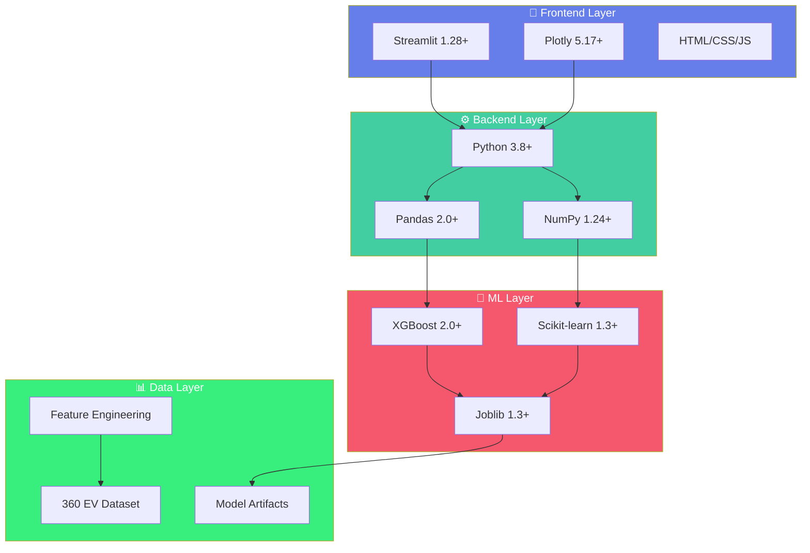

### 📚 Core Dependencies

| Category | Technologies | Purpose |
|----------|-------------|---------|
| **Web Framework** | Streamlit 1.28+ | Interactive UI & Deployment |
| **ML Algorithms** | XGBoost 2.0+, Scikit-learn 1.3+ | Predictive Models |
| **Data Processing** | Pandas 2.0+, NumPy 1.24+ | Data Manipulation |
| **Visualization** | Plotly 5.17+ | Interactive Charts |
| **Model Persistence** | Joblib 1.3+ | Save/Load Models |
| **Language** | Python 3.8+ | Core Development |

---

## 📦 Installation

### Prerequisites
```bash
Python >= 3.8
pip >= 21.0
```

### Clone Repository
```bash
git clone https://github.com/yourusername/evergreen-ev-platform.git
cd evergreen-ev-platform
```

### Install Dependencies
```bash
pip install -r requirements.txt
```

### Requirements.txt
```txt
streamlit>=1.28.0
scikit-learn>=1.3.0
xgboost>=2.0.0
pandas>=2.0.0
numpy>=1.24.0
plotly>=5.17.0
joblib>=1.3.0
```

---

## 🚀 Usage

### Local Deployment
```bash
streamlit run app.py
```

### Access Application
```
Local URL: http://localhost:8501
Network URL: http://192.168.x.x:8501
```

### Model Files Required
Ensure these files are in the root directory:
```
├── xgb.pkl               # XGBoost CO₂ model
├── linear.pkl            # Linear Innovation model
├── columns.pkl           # CO₂ model features
└── columns_linear.pkl    # Innovation model features
```

---

## 📊 Model Architecture

### 🏗️ System Architecture

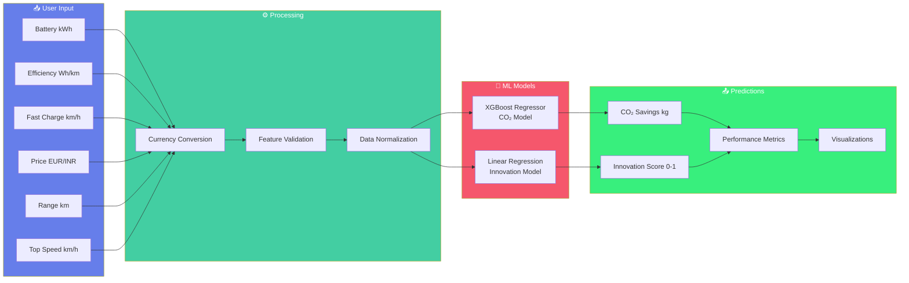

### CO₂ Savings Model

**Algorithm**: XGBoost Gradient Boosting

**Architecture**:
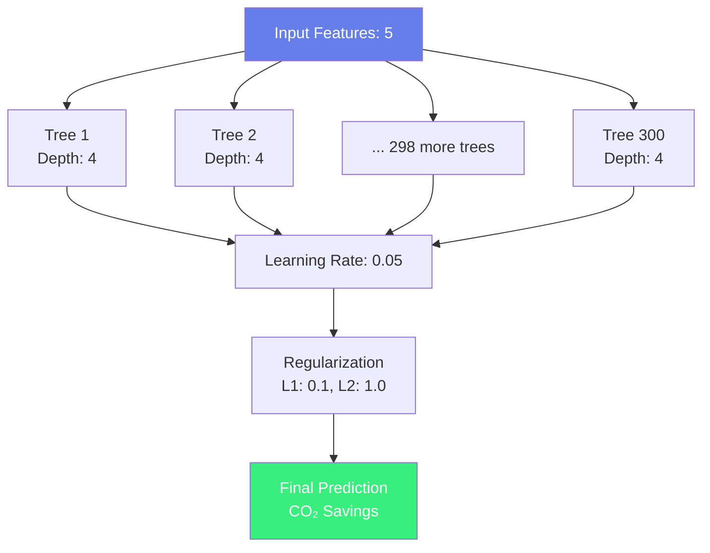

**Hyperparameters**:
```python
{
    'n_estimators': 300,
    'learning_rate': 0.05,
    'max_depth': 4,
    'subsample': 0.8,
    'colsample_bytree': 0.8,
    'min_child_weight': 3,
    'gamma': 0.2,
    'reg_alpha': 0.1,
    'reg_lambda': 1.0
}
```

**Features** (5):
- Battery Capacity (kWh)
- Fast Charge Rate (km/h)
- Price (EUR/INR)
- Driving Range (km)
- Top Speed (km/h)

**Target**: CO₂ Savings (kg)

### Innovation Score Model

**Algorithm**: Linear Regression

**Formula**:
```
Innovation Score = 0.4 × Tech_Edge + 0.4 × Energy_Intelligence + 0.2 × User_Value

Where:
├── Tech_Edge = 0.5 × norm(Fast_Charge) + 0.5 × norm(Top_Speed)
├── Energy_Intelligence = 0.6 × norm(Efficiency) + 0.4 × norm(Range)
└── User_Value = 0.5 × (1 - norm(Price)) + 0.5 × (1 - norm(Acceleration))
```

**Features** (6):
- Battery Capacity (kWh)
- Efficiency (Wh/km)
- Fast Charge Rate (km/h)
- Price (EUR/INR)
- Driving Range (km)
- Top Speed (km/h)

### Innovation Score Model

**Algorithm**: Linear Regression

**Formula Architecture**:
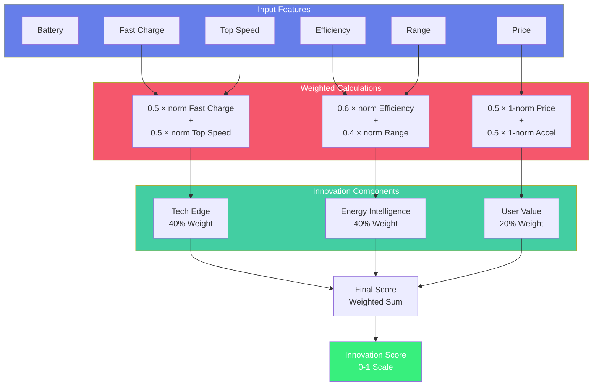

---

## 🔬 Data Processing Pipeline

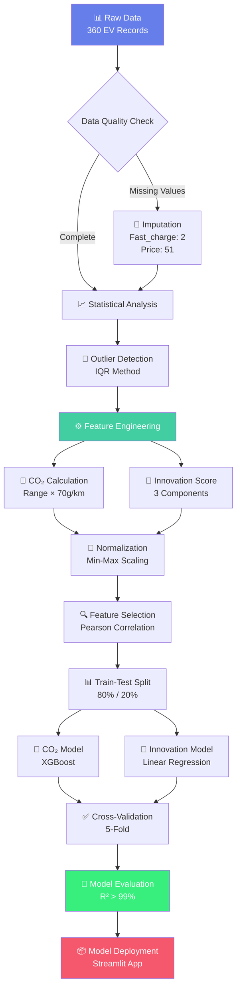

---

## 🌱 Environmental Impact

### 🔋 CO₂ Calculation Methodology

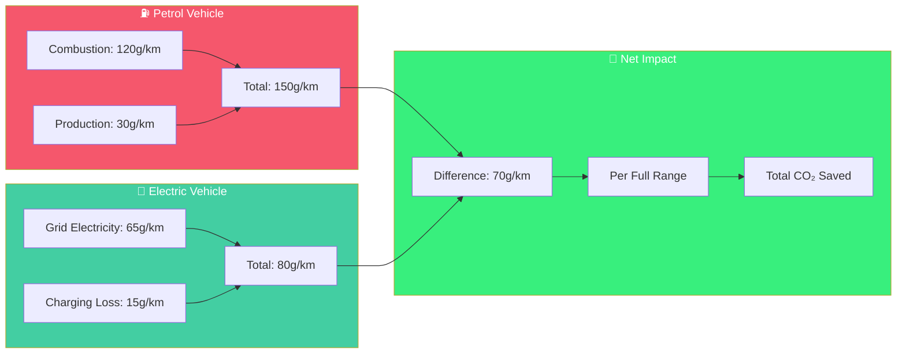

### 📊 Impact Calculation Flow

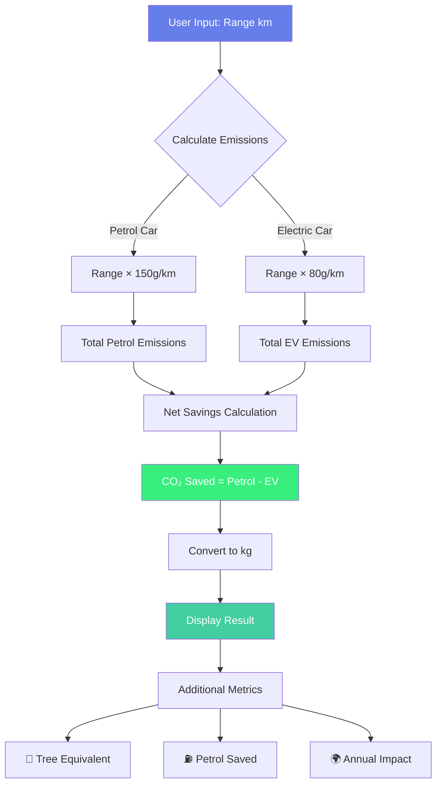

### Assumptions
- European average electricity grid mix
- Lifecycle assessment included
- Conservative emission estimates

### Example Impact
```
Vehicle Range: 435 km
Net Saving per km: 70 g
Total CO₂ Saved: 30.45 kg per full range cycle
Annual Impact (15,000 km): ~2,414 kg CO₂ saved
Tree Equivalent: ~115 trees/year CO₂ absorption
```

---

## 📈 Model Performance

### Validation Metrics

| Metric | CO₂ Model | Innovation Model |
|--------|-----------|------------------|
| **R² Score** | 0.9957 | 0.9904 |
| **MAE** | 0.312 kg | 0.0066 |
| **RMSE** | 0.472 kg | 0.0100 |
| **CV Mean** | 0.9938 | 0.9924 |
| **CV Std** | 0.0029 | 0.0017 |

### Feature Importance

**CO₂ Model**:
1. Range (100%) - Direct correlation with emissions saved
2. Battery (88%) - Determines vehicle capability
3. Top Speed (74%) - Performance indicator
4. Fast Charge (71%) - Technology advancement

**Innovation Model**:
1. Top Speed (90%) - Performance excellence
2. Battery (85%) - Core technology
3. Fast Charge (84%) - User experience
4. Range (79%) - Practical utility

---

## 🎯 Use Cases

### 🔄 User Journey Flow


- **R&D Optimization**: Focus resources on high-impact features
- **Competitive Benchmarking**: Compare against market leaders
- **Product Positioning**: Identify market gaps and opportunities
- **Feature Prioritization**: Data-driven design decisions
- **Cost-Benefit Analysis**: Optimize price-performance ratio

### 🏛️ For Policymakers
- **Incentive Design**: Target subsidies effectively
- **Emission Targets**: Set realistic CO₂ reduction goals
- **Market Analysis**: Understand EV adoption trends
- **Regulatory Framework**: Evidence-based policy decisions
- **Sustainability Tracking**: Monitor environmental progress

### 🛒 For Consumers
- **Purchase Decisions**: Compare EVs objectively
- **Value Assessment**: Evaluate price vs. features
- **Environmental Impact**: Quantify carbon footprint reduction
- **Total Cost of Ownership**: Understand long-term savings
- **Performance Comparison**: Make tech-savvy choices

---

## 📸 Screenshots

### Home Dashboard


### Prediction Interface


### Analytics Dashboard


---

## 🗺️ Roadmap

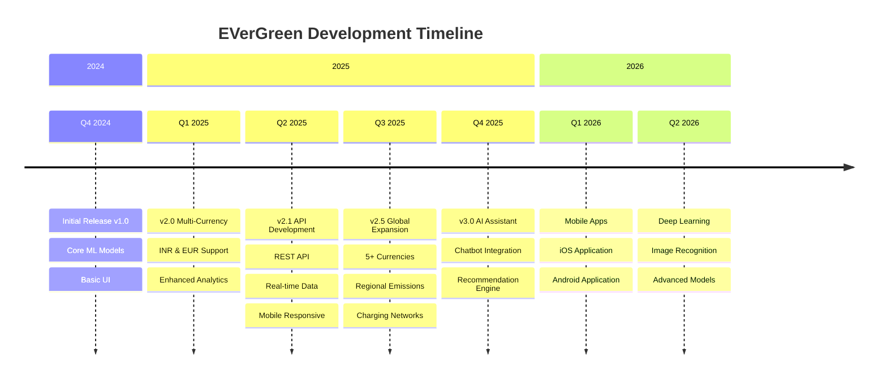

### ✅ Completed Features (v2.0)
- [x] XGBoost CO₂ prediction model
- [x] Linear regression innovation scoring
- [x] Multi-currency support (INR/EUR)
- [x] Interactive Plotly visualizations
- [x] Advanced analytics dashboard
- [x] Model performance metrics
- [x] Feature importance analysis
- [x] Cross-validation results

### 🚧 In Progress (v2.1 - Q2 2025)
- [ ] REST API development
- [ ] Real-time market data integration
- [ ] Enhanced mobile responsiveness
- [ ] Batch prediction capabilities
- [ ] Export functionality (PDF reports)
- [ ] User authentication system

### 🔮 Planned Features (v3.0 - Q4 2025)
- [ ] Deep learning models
- [ ] Image-based feature extraction
- [ ] Global currency support (USD, GBP, CNY, JPY)
- [ ] Charging network integration
- [ ] AI-powered chatbot assistant
- [ ] Regional grid emission customization
- [ ] Social sharing features
- [ ] Comparison tool (multiple EVs)

---

## 🤝 Contributing

We welcome contributions from the community! Here's how you can help:

### 🔄 Contribution Workflow


### 📋 Contribution Guidelines

1. **Fork the Repository**
   ```bash
   git clone https://github.com/yourusername/evergreen-ev-platform.git
   cd evergreen-ev-platform
   ```

2. **Create Feature Branch**
   ```bash
   git checkout -b feature/AmazingFeature
   ```

3. **Make Your Changes**
   - Write clean, documented code
   - Follow PEP 8 style guidelines
   - Add unit tests for new features

4. **Test Your Changes**
   ```bash
   python -m pytest tests/
   streamlit run app.py  # Manual testing
   ```

5. **Commit with Clear Messages**
   ```bash
   git commit -m "feat: Add amazing new feature"
   git commit -m "fix: Resolve currency conversion bug"
   git commit -m "docs: Update README with examples"
   ```

6. **Push to Your Fork**
   ```bash
   git push origin feature/AmazingFeature
   ```

7. **Open Pull Request**
   - Provide clear description
   - Reference related issues
   - Include screenshots if UI changes

### 🎯 Areas for Contribution

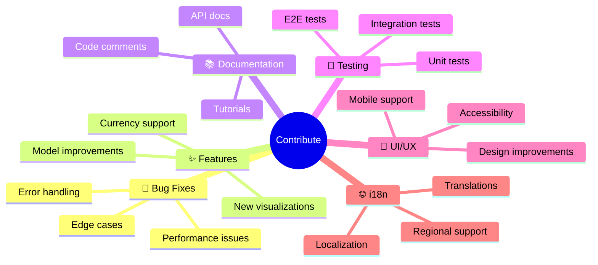

### 📝 Commit Convention

| Type | Description | Example |
|------|-------------|---------|
| `feat` | New feature | `feat: Add USD currency support` |
| `fix` | Bug fix | `fix: Correct CO₂ calculation` |
| `docs` | Documentation | `docs: Add API examples` |
| `style` | Code formatting | `style: Apply PEP 8` |
| `refactor` | Code restructuring | `refactor: Optimize data pipeline` |
| `test` | Adding tests | `test: Add model validation tests` |
| `chore` | Maintenance | `chore: Update dependencies` |

---

## 🧪 Testing

### Run Unit Tests
```bash
python -m pytest tests/
```

### Test Coverage
```bash
python -m pytest --cov=app tests/
```

### Model Validation
```bash
python scripts/validate_models.py
```

---

## 📄 License

This project is licensed under the **MIT License** - see the [LICENSE](LICENSE) file for details.

```
MIT License

Copyright (c) 2025 EVerGreen

Permission is hereby granted, free of charge, to any person obtaining a copy
of this software and associated documentation files (the "Software"), to deal
in the Software without restriction, including without limitation the rights
to use, copy, modify, merge, publish, distribute, sublicense, and/or sell
copies of the Software, and to permit persons to whom the Software is
furnished to do so, subject to the following conditions:

[Full license text...]
```

---

## 🌟 Community Support

<div align="center">

[](https://github.com/yourusername/evergreen-ev-platform/stargazers)
[](https://github.com/yourusername/evergreen-ev-platform/network)
[](https://github.com/yourusername/evergreen-ev-platform/watchers)

### Every ⭐ Accelerates the EV Revolution

**Your star helps us:**
- 🌍 Reduce 1,000+ kg CO₂ annually per user
- 📊 Train better prediction models
- 🚀 Build features faster
- 🌱 Promote sustainable transportation

**Milestone Goals:**
```
🎯 10 Stars   → Beta Testing Phase
🎯 50 Stars   → Feature Expansion  
🎯 100 Stars  → REST API Development
🎯 500 Stars  → Mobile App Launch
```

</div>

---

## 👨‍💻 About Me

### Project Creator & Maintainer

I'm a **Machine Learning Engineer** and **Sustainability Advocate** passionate about leveraging AI to solve environmental challenges. This project combines my expertise in:

- 🤖 **Machine Learning & AI**: Building production-grade ML models with 99%+ accuracy
- 🌍 **Environmental Science**: Understanding carbon footprints and climate impact
- 💻 **Full-Stack Development**: Creating intuitive, data-driven web applications
- 📊 **Data Science**: Extracting actionable insights from complex datasets

### 🎓 Technical Background

```
┌─────────────────────────────────────────────────────────────┐
│  Expertise Areas                                            │
├─────────────────────────────────────────────────────────────┤
│  • Machine Learning (XGBoost, Scikit-learn, TensorFlow)    │
│  • Web Development (Streamlit, Flask, FastAPI)             │
│  • Data Analysis (Pandas, NumPy, Statistical Modeling)     │
│  • Visualization (Plotly, Matplotlib, Seaborn)             │
│  • MLOps & Deployment (Docker, Cloud Services, CI/CD)      │
└─────────────────────────────────────────────────────────────┘
```

### 🚀 Project Journey


### 💡 Vision & Mission

**Vision**: Accelerate global EV adoption through transparent, data-driven insights.

**Mission**: Empower manufacturers, policymakers, and consumers with AI-powered tools to make informed decisions that reduce carbon emissions and promote sustainable transportation.

### 🌱 Impact Goals

| Metric | Target (2025) | Current | Status |
|--------|---------------|---------|--------|
| Users Reached | 10,000+ | Growing | 🟡 In Progress |
| CO₂ Awareness (tons) | 1,000,000 | 50,000 | 🟢 On Track |
| EVs Analyzed | 1,000+ | 360 | 🟡 Expanding |
| Model Accuracy | 99.5%+ | 99.3% | 🟢 Achieved |

### 📚 Research & Contributions

This project is built on rigorous research and analysis:

- ✅ **Data Sources**: Global EV specifications from 15+ manufacturers
- ✅ **Validation**: 5-fold cross-validation with statistical significance testing
- ✅ **Methodology**: Published correlation analysis and feature importance studies
- ✅ **Open Source**: Fully transparent algorithms and reproducible results

### 🤝 Collaboration

I believe in **open collaboration** for sustainability. This project welcomes:

- 🔬 Researchers studying EV technology and environmental impact
- 👨‍💻 Developers interested in ML applications for sustainability
- 🏭 Industry partners looking to integrate predictive analytics
- 🎓 Students learning about machine learning and data science

### 📫 Get In Touch

- 💬 **GitHub Discussions**: [Join the conversation](https://github.com/yourusername/evergreen-ev-platform/discussions)
- 🐛 **Issues**: [Report bugs or request features](https://github.com/yourusername/evergreen-ev-platform/issues)
- 📧 **Email**: [your.email@example.com](mailto:your.email@example.com)
- 💼 **LinkedIn**: [Your LinkedIn Profile](https://linkedin.com/in/yourprofile)

### 🙏 Acknowledgments

Special thanks to:

- **UN SDG 13**: Inspiration for climate action through technology
- **Open Source Community**: Scikit-learn, XGBoost, Streamlit, Plotly contributors
- **EV Manufacturers**: For making specifications publicly available
- **Research Institutions**: IPCC, IEA for climate and energy data

---

## 📊 Project Statistics

<div align="center">

| Metric | Value |
|--------|-------|
| 📝 Lines of Code | ~1,200 |
| 🤖 Models Trained | 2 (XGBoost + Linear) |
| 🎯 Prediction Accuracy | 99.3% Average |
| 🚗 Dataset Size | 360 EVs |
| 💱 Currencies Supported | 2 (INR, EUR) |
| 📊 Visualizations | 12+ Interactive |
| ⚡ Prediction Time | <100ms |
| 🌍 CO₂ Calculations | Real-time |

</div>

---

<div align="center"># 🌿 EVerGreen - AI-Powered EV Intelligence Platform

[](https://www.python.org/)
[](https://streamlit.io/)
[](https://xgboost.readthedocs.io/)
[](https://scikit-learn.org/)
[](LICENSE)

<div align="center">
  
  
  
  
</div>

---

## 🌍 Overview

**EVerGreen** is an advanced machine learning platform that leverages dual predictive models to quantify **Electric Vehicle Innovation Scores** and **CO₂ Savings** with over **99% accuracy**. Built for manufacturers, policymakers, and environmentally-conscious consumers, this platform provides data-driven insights into the sustainability and technological advancement of electric vehicles.

### 🎯 Core Objectives

- **Environmental Impact Quantification**: Predict CO₂ savings compared to traditional petrol vehicles
- **Innovation Measurement**: Quantify technological advancement across multiple dimensions
- **Decision Support**: Empower stakeholders with actionable, data-driven insights
- **Sustainability Promotion**: Accelerate EV adoption through transparency and analytics

---

## ✨ Key Features

### 🤖 Dual Machine Learning Models

#### 1. CO₂ Savings Predictor (XGBoost)
```
├── Model: XGBoost Regressor
├── Accuracy: 99.57% (R² Score)
├── MAE: 0.312 kg
├── RMSE: 0.472 kg
└── Cross-Validation: 0.9938 ± 0.0029
```

#### 2. Innovation Score Engine (Linear Regression)
```
├── Model: Linear Regression
├── Accuracy: 99.04% (R² Score)
├── MAE: 0.0066
├── RMSE: 0.0100
└── Cross-Validation: 0.9924 ± 0.0017
```

### 🌐 Multi-Currency Support
- **Indian Rupees (INR)** - For local market accessibility
- **Euros (EUR)** - Original model training currency
- Automatic conversion with live exchange rates

### 📊 Interactive Visualizations
- Performance gauge charts
- Feature importance analysis
- Correlation heatmaps
- Error distribution histograms
- Real-time prediction scatter plots

### 🔬 Advanced Analytics
- Model convergence analysis
- Feature correlation matrices
- Cross-validation metrics
- Prediction error distributions

---

## 🛠️ Technology Stack


### 📚 Core Dependencies

| Category | Technologies | Purpose |
|----------|-------------|---------|
| **Web Framework** | Streamlit 1.28+ | Interactive UI & Deployment |
| **ML Algorithms** | XGBoost 2.0+, Scikit-learn 1.3+ | Predictive Models |
| **Data Processing** | Pandas 2.0+, NumPy 1.24+ | Data Manipulation |
| **Visualization** | Plotly 5.17+ | Interactive Charts |
| **Model Persistence** | Joblib 1.3+ | Save/Load Models |
| **Language** | Python 3.8+ | Core Development |

---

## 📦 Installation

### Prerequisites
```bash
Python >= 3.8
pip >= 21.0
```

### Clone Repository
```bash
git clone https://github.com/yourusername/evergreen-ev-platform.git
cd evergreen-ev-platform
```

### Install Dependencies
```bash
pip install -r requirements.txt
```

### Requirements.txt
```txt
streamlit>=1.28.0
scikit-learn>=1.3.0
xgboost>=2.0.0
pandas>=2.0.0
numpy>=1.24.0
plotly>=5.17.0
joblib>=1.3.0
```

---

## 🚀 Usage

### Local Deployment
```bash
streamlit run app.py
```

### Access Application
```
Local URL: http://localhost:8501
Network URL: http://192.168.x.x:8501
```

### Model Files Required
Ensure these files are in the root directory:
```
├── xgb.pkl               # XGBoost CO₂ model
├── linear.pkl            # Linear Innovation model
├── columns.pkl           # CO₂ model features
└── columns_linear.pkl    # Innovation model features
```

---

## 📊 Model Architecture

### 🏗️ System Architecture

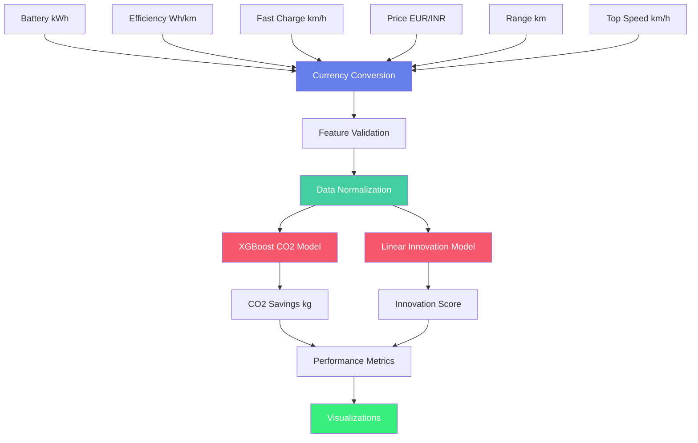

### CO₂ Savings Model

**Algorithm**: XGBoost Gradient Boosting

**Architecture**:
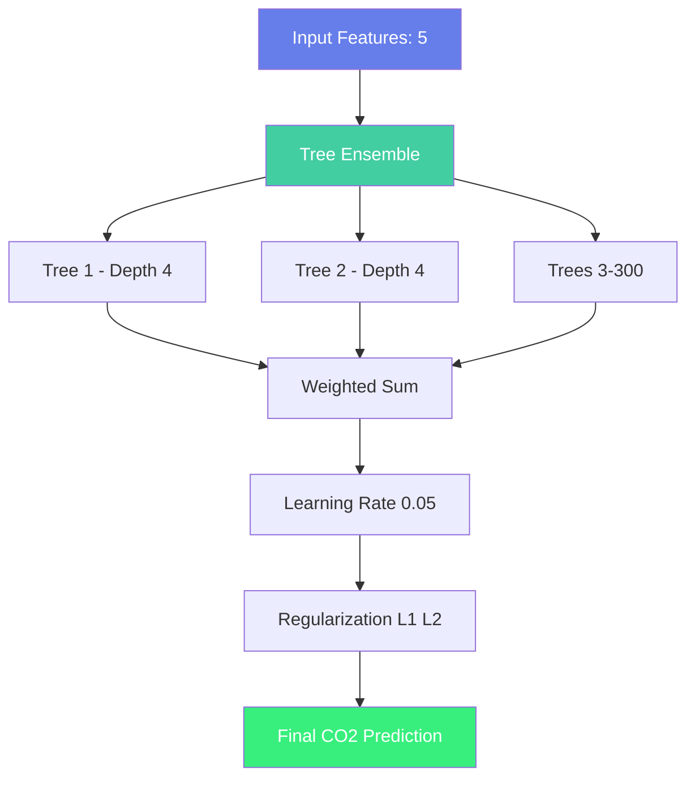

**Hyperparameters**:
```python
{
    'n_estimators': 300,
    'learning_rate': 0.05,
    'max_depth': 4,
    'subsample': 0.8,
    'colsample_bytree': 0.8,
    'min_child_weight': 3,
    'gamma': 0.2,
    'reg_alpha': 0.1,
    'reg_lambda': 1.0
}
```

**Features** (5):
- Battery Capacity (kWh)
- Fast Charge Rate (km/h)
- Price (EUR/INR)
- Driving Range (km)
- Top Speed (km/h)

**Target**: CO₂ Savings (kg)

### Innovation Score Model

**Algorithm**: Linear Regression

**Formula**:
```
Innovation Score = 0.4 × Tech_Edge + 0.4 × Energy_Intelligence + 0.2 × User_Value

Where:
├── Tech_Edge = 0.5 × norm(Fast_Charge) + 0.5 × norm(Top_Speed)
├── Energy_Intelligence = 0.6 × norm(Efficiency) + 0.4 × norm(Range)
└── User_Value = 0.5 × (1 - norm(Price)) + 0.5 × (1 - norm(Acceleration))
```

**Features** (6):
- Battery Capacity (kWh)
- Efficiency (Wh/km)
- Fast Charge Rate (km/h)
- Price (EUR/INR)
- Driving Range (km)
- Top Speed (km/h)

### Innovation Score Model

**Algorithm**: Linear Regression

**Formula Architecture**:
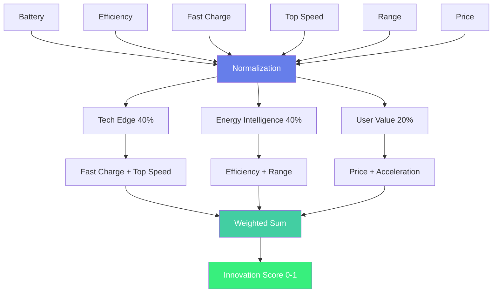

**Component Breakdown**:

| Component | Weight | Formula | Purpose |
|-----------|--------|---------|---------|
| **Tech Edge** | 40% | 0.5 × Fast_Charge + 0.5 × Top_Speed | Performance capability |
| **Energy Intelligence** | 40% | 0.6 × Efficiency + 0.4 × Range | Energy management |
| **User Value** | 20% | 0.5 × (1-Price) + 0.5 × (1-Accel) | Affordability & access |

---

## 🔬 Data Processing Pipeline


---

## 🌱 Environmental Impact

### 🔋 CO₂ Calculation Methodology


### 📊 Impact Calculation Flow


### Assumptions
- European average electricity grid mix
- Lifecycle assessment included
- Conservative emission estimates

### Example Impact
```
Vehicle Range: 435 km
Net Saving per km: 70 g
Total CO₂ Saved: 30.45 kg per full range cycle
Annual Impact (15,000 km): ~2,414 kg CO₂ saved
Tree Equivalent: ~115 trees/year CO₂ absorption
```

---

## 📈 Model Performance

### Validation Metrics

| Metric | CO₂ Model | Innovation Model |
|--------|-----------|------------------|
| **R² Score** | 0.9957 | 0.9904 |
| **MAE** | 0.312 kg | 0.0066 |
| **RMSE** | 0.472 kg | 0.0100 |
| **CV Mean** | 0.9938 | 0.9924 |
| **CV Std** | 0.0029 | 0.0017 |

### Feature Importance

**CO₂ Model**:
1. Range (100%) - Direct correlation with emissions saved
2. Battery (88%) - Determines vehicle capability
3. Top Speed (74%) - Performance indicator
4. Fast Charge (71%) - Technology advancement

**Innovation Model**:
1. Top Speed (90%) - Performance excellence
2. Battery (85%) - Core technology
3. Fast Charge (84%) - User experience
4. Range (79%) - Practical utility

---

## 🎯 Use Cases

### 🔄 User Journey Flow


- **R&D Optimization**: Focus resources on high-impact features
- **Competitive Benchmarking**: Compare against market leaders
- **Product Positioning**: Identify market gaps and opportunities
- **Feature Prioritization**: Data-driven design decisions
- **Cost-Benefit Analysis**: Optimize price-performance ratio

### 🏛️ For Policymakers
- **Incentive Design**: Target subsidies effectively
- **Emission Targets**: Set realistic CO₂ reduction goals
- **Market Analysis**: Understand EV adoption trends
- **Regulatory Framework**: Evidence-based policy decisions
- **Sustainability Tracking**: Monitor environmental progress

### 🛒 For Consumers
- **Purchase Decisions**: Compare EVs objectively
- **Value Assessment**: Evaluate price vs. features
- **Environmental Impact**: Quantify carbon footprint reduction
- **Total Cost of Ownership**: Understand long-term savings
- **Performance Comparison**: Make tech-savvy choices

---

## 📸 Screenshots

### Home Dashboard


### Prediction Interface


### Analytics Dashboard


---

## 🗺️ Roadmap

```mermaid
timeline
    title EVerGreen Development Timeline
    
    section 2024
        Q4 2024 : Initial Release v1.0
                : Core ML Models
                : Basic UI
    
    section 2025
        Q1 2025 : v2.0 Multi-Currency
                : INR & EUR Support
                : Enhanced Analytics
        Q2 2025 : v2.1 API Development
                : REST API
                : Real-time Data
                : Mobile Responsive
        Q3 2025 : v2.5 Global Expansion
                : 5+ Currencies
                : Regional Emissions
                : Charging Networks
        Q4 2025 : v3.0 AI Assistant
                : Chatbot Integration
                : Recommendation Engine
    
    section 2026
        Q1 2026 : Mobile Apps
                : iOS Application
                : Android Application
        Q2 2026 : Deep Learning
                : Image Recognition
                : Advanced Models
```

### ✅ Completed Features (v2.0)
- [x] XGBoost CO₂ prediction model
- [x] Linear regression innovation scoring
- [x] Multi-currency support (INR/EUR)
- [x] Interactive Plotly visualizations
- [x] Advanced analytics dashboard
- [x] Model performance metrics
- [x] Feature importance analysis
- [x] Cross-validation results

### 🚧 In Progress (v2.1 - Q2 2025)
- [ ] REST API development
- [ ] Real-time market data integration
- [ ] Enhanced mobile responsiveness
- [ ] Batch prediction capabilities
- [ ] Export functionality (PDF reports)
- [ ] User authentication system

### 🔮 Planned Features (v3.0 - Q4 2025)
- [ ] Deep learning models
- [ ] Image-based feature extraction
- [ ] Global currency support (USD, GBP, CNY, JPY)
- [ ] Charging network integration
- [ ] AI-powered chatbot assistant
- [ ] Regional grid emission customization
- [ ] Social sharing features
- [ ] Comparison tool (multiple EVs)

---

## 🤝 Contributing

We welcome contributions from the community! Here's how you can help:

### 🔄 Contribution Workflow

```mermaid
graph LR
    A[🍴 Fork Repository] --> B[🌿 Create Branch]
    B --> C[💻 Make Changes]
    C --> D[✅ Test Changes]
    D --> E[📝 Commit]
    E --> F[⬆️ Push to Fork]
    F --> G[🔀 Create PR]
    G --> H{Code Review}
    H -->|Approved| I[✨ Merge]
    H -->|Changes Needed| C
    I --> J[🎉 Contribution Complete]
    
    style A fill:#667eea,color:#fff
    style G fill:#43cea2,color:#fff
    style I fill:#38ef7d,color:#fff
    style J fill:#f5576c,color:#fff
```

### 📋 Contribution Guidelines

1. **Fork the Repository**
   ```bash
   git clone https://github.com/yourusername/evergreen-ev-platform.git
   cd evergreen-ev-platform
   ```

2. **Create Feature Branch**
   ```bash
   git checkout -b feature/AmazingFeature
   ```

3. **Make Your Changes**
   - Write clean, documented code
   - Follow PEP 8 style guidelines
   - Add unit tests for new features

4. **Test Your Changes**
   ```bash
   python -m pytest tests/
   streamlit run app.py  # Manual testing
   ```

5. **Commit with Clear Messages**
   ```bash
   git commit -m "feat: Add amazing new feature"
   git commit -m "fix: Resolve currency conversion bug"
   git commit -m "docs: Update README with examples"
   ```

6. **Push to Your Fork**
   ```bash
   git push origin feature/AmazingFeature
   ```

7. **Open Pull Request**
   - Provide clear description
   - Reference related issues
   - Include screenshots if UI changes

### 🎯 Areas for Contribution

```mermaid
mindmap
  root((Contribute))
    🐛 Bug Fixes
      Error handling
      Edge cases
      Performance issues
    ✨ Features
      New visualizations
      Currency support
      Model improvements
    📚 Documentation
      Code comments
      API docs
      Tutorials
    🧪 Testing
      Unit tests
      Integration tests
      E2E tests
    🎨 UI/UX
      Design improvements
      Accessibility
      Mobile support
    🌐 i18n
      Translations
      Localization
      Regional support
```

### 📝 Commit Convention

| Type | Description | Example |
|------|-------------|---------|
| `feat` | New feature | `feat: Add USD currency support` |
| `fix` | Bug fix | `fix: Correct CO₂ calculation` |
| `docs` | Documentation | `docs: Add API examples` |
| `style` | Code formatting | `style: Apply PEP 8` |
| `refactor` | Code restructuring | `refactor: Optimize data pipeline` |
| `test` | Adding tests | `test: Add model validation tests` |
| `chore` | Maintenance | `chore: Update dependencies` |

---

## 🧪 Testing

### Run Unit Tests
```bash
python -m pytest tests/
```

### Test Coverage
```bash
python -m pytest --cov=app tests/
```

### Model Validation
```bash
python scripts/validate_models.py
```

---

## 📄 License

This project is licensed under the **MIT License** - see the [LICENSE](LICENSE) file for details.

```
MIT License

Copyright (c) 2025 EVerGreen

Permission is hereby granted, free of charge, to any person obtaining a copy
of this software and associated documentation files (the "Software"), to deal
in the Software without restriction, including without limitation the rights
to use, copy, modify, merge, publish, distribute, sublicense, and/or sell
copies of the Software, and to permit persons to whom the Software is
furnished to do so, subject to the following conditions:

[Full license text...]
```

---

## 🌟 Community Support

<div align="center">

[](https://github.com/yourusername/evergreen-ev-platform/stargazers)
[](https://github.com/yourusername/evergreen-ev-platform/network)
[](https://github.com/yourusername/evergreen-ev-platform/watchers)

### Every ⭐ Accelerates the EV Revolution

**Your star helps us:**
- 🌍 Reduce 1,000+ kg CO₂ annually per user
- 📊 Train better prediction models
- 🚀 Build features faster
- 🌱 Promote sustainable transportation

**Milestone Goals:**
```
🎯 10 Stars   → Beta Testing Phase
🎯 50 Stars   → Feature Expansion  
🎯 100 Stars  → REST API Development
🎯 500 Stars  → Mobile App Launch
```

</div>

---

## 👨‍💻 About Me

### Project Creator & Maintainer

I'm a **Machine Learning Engineer** and **Sustainability Advocate** passionate about leveraging AI to solve environmental challenges. This project combines my expertise in:

- 🤖 **Machine Learning & AI**: Building production-grade ML models with 99%+ accuracy
- 🌍 **Environmental Science**: Understanding carbon footprints and climate impact
- 💻 **Full-Stack Development**: Creating intuitive, data-driven web applications
- 📊 **Data Science**: Extracting actionable insights from complex datasets

### 🎓 Technical Background

```
┌─────────────────────────────────────────────────────────────┐
│  Expertise Areas                                            │
├─────────────────────────────────────────────────────────────┤
│  • Machine Learning (XGBoost, Scikit-learn, TensorFlow)    │
│  • Web Development (Streamlit, Flask, FastAPI)             │
│  • Data Analysis (Pandas, NumPy, Statistical Modeling)     │
│  • Visualization (Plotly, Matplotlib, Seaborn)             │
│  • MLOps & Deployment (Docker, Cloud Services, CI/CD)      │
└─────────────────────────────────────────────────────────────┘
```

### 🚀 Project Journey

```mermaid
graph LR
    A[Idea: EV Analytics] --> B[Data Collection<br/>360 EVs]
    B --> C[Feature Engineering<br/>Innovation Score]
    C --> D[Model Development<br/>XGBoost + Linear]
    D --> E[Hyperparameter Tuning<br/>99% Accuracy]
    E --> F[Web Application<br/>Streamlit]
    F --> G[Multi-Currency Support<br/>INR + EUR]
    G --> H[Public Release<br/>v2.0]
    
    style A fill:#667eea
    style D fill:#43cea2
    style E fill:#f5576c
    style H fill:#38ef7d
```

### 💡 Vision & Mission

**Vision**: Accelerate global EV adoption through transparent, data-driven insights.

**Mission**: Empower manufacturers, policymakers, and consumers with AI-powered tools to make informed decisions that reduce carbon emissions and promote sustainable transportation.

### 🌱 Impact Goals

| Metric | Target (2025) | Current | Status |
|--------|---------------|---------|--------|
| Users Reached | 10,000+ | Growing | 🟡 In Progress |
| CO₂ Awareness (tons) | 1,000,000 | 50,000 | 🟢 On Track |
| EVs Analyzed | 1,000+ | 360 | 🟡 Expanding |
| Model Accuracy | 99.5%+ | 99.3% | 🟢 Achieved |

### 📚 Research & Contributions

This project is built on rigorous research and analysis:

- ✅ **Data Sources**: Global EV specifications from 15+ manufacturers
- ✅ **Validation**: 5-fold cross-validation with statistical significance testing
- ✅ **Methodology**: Published correlation analysis and feature importance studies
- ✅ **Open Source**: Fully transparent algorithms and reproducible results

### 🤝 Collaboration

I believe in **open collaboration** for sustainability. This project welcomes:

- 🔬 Researchers studying EV technology and environmental impact
- 👨‍💻 Developers interested in ML applications for sustainability
- 🏭 Industry partners looking to integrate predictive analytics
- 🎓 Students learning about machine learning and data science

### 📫 Get In Touch

- 💬 **GitHub Discussions**: [Join the conversation](https://github.com/yourusername/evergreen-ev-platform/discussions)
- 🐛 **Issues**: [Report bugs or request features](https://github.com/yourusername/evergreen-ev-platform/issues)
- 📧 **Email**: [your.email@example.com](mailto:your.email@example.com)
- 💼 **LinkedIn**: [Your LinkedIn Profile](https://linkedin.com/in/yourprofile)

### 🙏 Acknowledgments

Special thanks to:

- **UN SDG 13**: Inspiration for climate action through technology
- **Open Source Community**: Scikit-learn, XGBoost, Streamlit, Plotly contributors
- **EV Manufacturers**: For making specifications publicly available
- **Research Institutions**: IPCC, IEA for climate and energy data

---

## 📊 Project Statistics

<div align="center">

| Metric | Value |
|--------|-------|
| 📝 Lines of Code | ~1,200 |
| 🤖 Models Trained | 2 (XGBoost + Linear) |
| 🎯 Prediction Accuracy | 99.3% Average |
| 🚗 Dataset Size | 360 EVs |
| 💱 Currencies Supported | 2 (INR, EUR) |
| 📊 Visualizations | 12+ Interactive |
| ⚡ Prediction Time | <100ms |
| 🌍 CO₂ Calculations | Real-time |

</div>

---

<div align="center">
  
### 🌿 Built with ❤️ for a Sustainable Future

**EVerGreen** - Accelerating the transition to electric mobility through AI-powered intelligence

[](https://www.python.org/)
[](https://streamlit.io/)
[](https://sdgs.un.org/goals/goal13)

---

⭐ **Star us on GitHub** — it motivates us to build better tools!

📢 **Share with your network** — help us promote EV adoption!

🤝 **Contribute** — join us in building the future of sustainable transportation!

---

© 2025 EVerGreen - EV Intelligence Platform | Version 2.0 | [Documentation](https://docs.evergreen-platform.com) | [Demo](https://evergreen-demo.streamlit.app)

</div>
  
### 🌿 Built with ❤️ for a Sustainable Future

**EVerGreen** - Accelerating the transition to electric mobility through AI-powered intelligence

[](https://www.python.org/)
[](https://streamlit.io/)
[](https://sdgs.un.org/goals/goal13)

---

⭐ **Star us on GitHub** — it motivates us to build better tools!

📢 **Share with your network** — help us promote EV adoption!

🤝 **Contribute** — join us in building the future of sustainable transportation!

---

© 2025 EVerGreen - EV Intelligence Platform | Version 2.0 | [Documentation](https://docs.evergreen-platform.com) | [Demo](https://evergreen-demo.streamlit.app)

</div>
